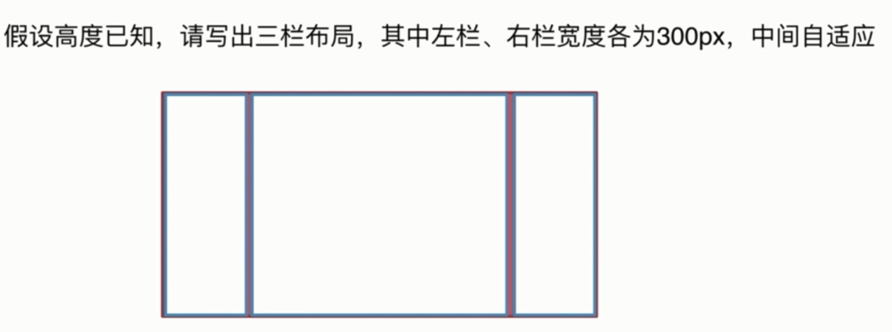

# 三栏布局题目

- 语义化掌握到位

- 页面布局理解深刻

- CSS 基础知识扎实

- 思维灵活积极上进

- 代码书写规范



公共部分代码:

```html
<!DOCTYPE html>
<html lang="en">

<head>
  <meta charset="UTF-8">
  <meta name="viewport" content="width=device-width, initial-scale=1.0">
  <meta http-equiv="X-UA-Compatible" content="ie=edge">
  <title>Layout</title>
  <style>
    html * {
      padding: 0;
      margin: 0;
    }

    .layout {
      margin-top: 20px;
    }

    .layout article div {
      min-height: 100px;
    }
  </style>
</head>

<body>

</body>

</html>
```