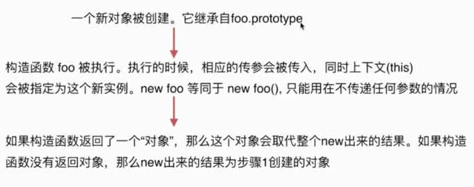

# new 运算符



- `new` 的原理

```js
var M = function() {this.name = 'o2'};

var new2 = function(func){
  var o = Object.create(func.prototype)
  var k = func.call(o)
  if(typeof k === 'object'){
    return k
  }else{
    return o
  }
}

o6 = new2(M)

// true
o6 instanceof M

// true
o6.__proto__.constructor === M

M.prototype.walk = function(){console.log('walk')}

// "walk"
o6.walk()
```