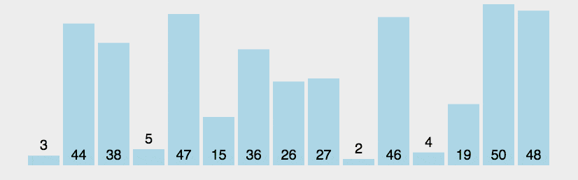

# 冒泡排序

排序思路：遍历数组，每次遍历就将最大（或最小）值推至最前. 越往后遍历查询次数越少



### 普通冒泡排序

```js
// 冒泡排序 每次将最小元素推至最前
function sort4(array) {
  var len = array.length,
  i, j, tmp, result;
  result = array.slice(0);
  for (i = 0; i < len; i++) {
    for (j = len - 1; j > i; j--) {
      if (result[j] < result[j - 1]) {
        tmp = result[j - 1];
        result[j - 1] = result[j];
        result[j] = tmp;
      }
    }
  }
  return result;
}
```

### 改进冒泡排序

优化思路：当一次遍历前后数组不产生变化时，说明该数组已经有序，结束排序。

```js
// 如果在某次的排序中没有出现交换的情况，
// 那么说明在无序的元素现在已经是有序了，就可以直接返回了。
function sort5(array) {
  var len = array.length,
  i, j, tmp, exchange, result;

  result = array.slice(0);
  for (i = 0; i < len; i++) {
    exchange = 0;
    for (j = len - 1; j > i; j--) {
      if (result[j] < result[j - 1]) {
        tmp = result[j];
        result[j] = result[j - 1];
        result[j - 1] = tmp;
        exchange = 1;
      }
    }
    if (!exchange) return result;
  }
  return result;
}
```