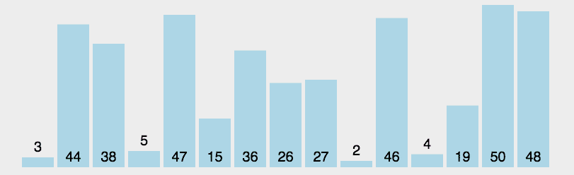

# 选择排序

原理非常简单：每次都找一个最大或者最小的排在开始即可。

首先在未排序序列中找到最小（大）元素，存放到排序序列的起始位置

再从剩余未排序元素中继续寻找最小（大）元素，然后放到已排序序列的末尾。

重复第二步，直到所有元素均排序完毕。



```js
// 在无序区中选出最小的元素，然后将它和无序区的第一个元素交换位置。
// 原理跟冒泡排序一样，算是冒泡的衍生版本
function sort7(array) {
  var len = array.length,
  i, j, k, tmp, result;

  result = array.slice(0);
  for (i = 0; i < len; i++) {
    k = i;
    for (j = i + 1; j < len; j++) {
      if (result[j] < result[k]) k = j;
    }
    if (k != i) {
      tmp = result[k];
      result[k] = result[i];
      result[i] = tmp;
    }
  }
  return result;
}
```