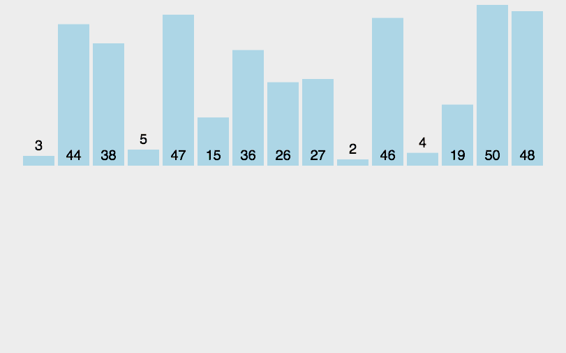

# 归并排序

申请空间，使其大小为两个已经排序序列之和，该空间用来存放合并后的序列；

设定两个指针，最初位置分别为两个已经排序序列的起始位置；

比较两个指针所指向的元素，选择相对小的元素放入到合并空间，并移动指针到下一位置；

重复步骤 3 直到某一指针达到序列尾；

将另一序列剩下的所有元素直接复制到合并序列尾。



```js
// 合并排序：将无序的数组 拆成N部分进行有序处理，然后合并；
// 参考代码： https://gist.github.com/paullewis/1982121
function sort9(array) {
  var result = array.slice(0);

  // 递归调用合并函数
  function sort(array) {
    var length = array.length,
    mid = Math.floor(length * 0.5),
    left = array.slice(0, mid),
    right = array.slice(mid, length);

    if (length === 1) {
      return array;
    }
    return merge(sort(left), sort(right));
  }

  // 合并 两有序的数组
  function merge(left, right) {
    var result = [];

    while (left.length || right.length) {

      if (left.length && right.length) {

        if (left[0] < right[0]) {
          result.push(left.shift());
        } else {
          result.push(right.shift());
        }

      } else if (left.length) {
        result.push(left.shift());
      } else {
        result.push(right.shift());
      }
    }
    return result;
  }

  return sort(result);
}
```