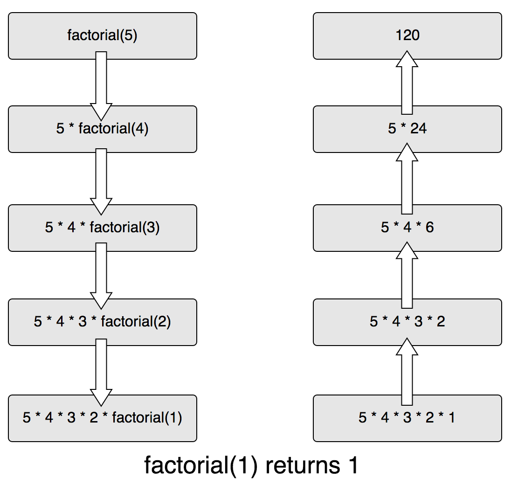

# 递归

[JavaScript 中的递归](https://segmentfault.com/a/1190000009857470)

### 递归简介

一个过程或函数在其定义或说明中有直接或间接调用自身的一种方法，它通常把一个大型复杂的问题层层转化为一个与原问题相似的规模较小的问题来求解，递归策略只需少量的程序就可描述出解题过程所需要的多次重复计算，大大地减少了程序的代码量。

我们来举个例子，我们可以用4的阶乘乘以4来定义5的阶乘，3的阶乘乘以4来定义4的阶乘，以此类推。

```js
factorial(5) = factorial(4) * 5
factorial(5) = factorial(3) * 4 * 5
factorial(5) = factorial(2) * 3 * 4 * 5
factorial(5) = factorial(1) * 2 * 3 * 4 * 5
factorial(5) = factorial(0) * 1 * 2 * 3 * 4 * 5
factorial(5) = 1 * 1 * 2 * 3 * 4 * 5
```

用Haskell的Pattern matching 可以很直观的定义factorial函数:

```js
factorial n = factorial (n-1)  * n
factorial 0 = 1
```

在递归的例子中，从第一个调用factorial(5)开始，一直递归调用factorial函数自身直到参数的值为0。下面是一个形象的图例：



### 递归的调用栈

为了理解调用栈，我们回到factorial函数的例子。

```js
function factorial(n) {
    if (n === 0) {
        return 1
    }

    return n * factorial(n - 1)
}
```

如果我们传入参数3，将会递归调用factorial(2)、factorial(1)和factorial(0)，因此会额外再调用factorial三次。

每次函数调用都会压入调用栈，整个调用栈如下:

```js
factorial(0) // 0的阶乘为1 
factorial(1) // 该调用依赖factorial(0)
factorial(2) // 该调用依赖factorial(1)
factorial(3) // 该掉用依赖factorial(2)
```

现在我们修改代码，插入console.trace()来查看每一次当前的调用栈的状态：

```js
function factorial(n) {
    console.trace()
    if (n === 0) {
        return 1
    }

    return n * factorial(n - 1)
}

factorial(3)
```

接下来我们看看调用栈是怎样的。
第一个：

```js
Trace
    at factorial (repl:2:9)
    at repl:1:1 // 请忽略以下底层实现细节代码
    at realRunInThisContextScript (vm.js:22:35)
    at sigintHandlersWrap (vm.js:98:12)
    at ContextifyScript.Script.runInThisContext (vm.js:24:12)
    at REPLServer.defaultEval (repl.js:313:29)
    at bound (domain.js:280:14)
    at REPLServer.runBound [as eval] (domain.js:293:12)
    at REPLServer.onLine (repl.js:513:10)
    at emitOne (events.js:101:20)
```

你会发现，该调用栈包含一个对factorial函数的调用，这里是factorial(3)。接下来就更加有趣了，我们来看第二次打印出来的调用栈：

```js
Trace
    at factorial (repl:2:9)
    at factorial (repl:7:12)
    at repl:1:1 // 请忽略以下底层实现细节代码
    at realRunInThisContextScript (vm.js:22:35)
    at sigintHandlersWrap (vm.js:98:12)
    at ContextifyScript.Script.runInThisContext (vm.js:24:12)
    at REPLServer.defaultEval (repl.js:313:29)
    at bound (domain.js:280:14)
    at REPLServer.runBound [as eval] (domain.js:293:12)
    at REPLServer.onLine (repl.js:513:10)
```

现在我们有两个对factorial函数的调用。

第三次：

```js
Trace
    at factorial (repl:2:9)
    at factorial (repl:7:12)
    at factorial (repl:7:12)
    at repl:1:1
    at realRunInThisContextScript (vm.js:22:35)
    at sigintHandlersWrap (vm.js:98:12)
    at ContextifyScript.Script.runInThisContext (vm.js:24:12)
    at REPLServer.defaultEval (repl.js:313:29)
    at bound (domain.js:280:14)
    at REPLServer.runBound [as eval] (domain.js:293:12)
```

第四次：

```js
Trace
    at factorial (repl:2:9)
    at factorial (repl:7:12)
    at factorial (repl:7:12)
    at factorial (repl:7:12)
    at repl:1:1
    at realRunInThisContextScript (vm.js:22:35)
    at sigintHandlersWrap (vm.js:98:12)
    at ContextifyScript.Script.runInThisContext (vm.js:24:12)
    at REPLServer.defaultEval (repl.js:313:29)
    at bound (domain.js:280:14)
```

设想，如果传入的参数值特别大，那么这个调用栈将会非常之大，最终可能超出调用栈的缓存大小而崩溃导致程序执行失败。那么如何解决这个问题呢？使用尾递归。

### 尾递归

尾递归是一种递归的写法，可以避免不断的将函数压栈最终导致堆栈溢出。通过设置一个累加参数，并且每一次都将当前的值累加上去，然后递归调用。

我们来看如何改写之前定义factorial函数为尾递归：

```js
function factorial(n, total = 1) {
    if (n === 0) {
        return total
    }

    return factorial(n - 1, n * total)
}
```

factorial(3)的执行步骤如下：

```js
factorial(3, 1)
factorial(2, 3)
factorial(1, 6)
factorial(0, 6)
```

调用栈不再需要多次对factorial进行压栈处理，因为每一个递归调用都不在依赖于上一个递归调用的值。因此，空间的复杂度为o(1)而不是0(n)。

接下来，通过console.trace()函数将调用栈打印出来。

```js
function factorial(n, total = 1) {
    console.trace()
    if (n === 0) {
        return total
    }

    return factorial(n - 1, n * total)
}

factorial(3)
```

很惊讶的发现，依然有很多压栈!

```js
// ...
// 下面是最后两次对factorial的调用
Trace
    at factorial (repl:2:9) // 3次压栈
    at factorial (repl:7:8)
    at factorial (repl:7:8)
    at repl:1:1 // 请忽略以下底层实现细节代码
    at realRunInThisContextScript (vm.js:22:35)
    at sigintHandlersWrap (vm.js:98:12)
    at ContextifyScript.Script.runInThisContext (vm.js:24:12)
    at REPLServer.defaultEval (repl.js:313:29)
    at bound (domain.js:280:14)
    at REPLServer.runBound [as eval] (domain.js:293:12)
Trace
    at factorial (repl:2:9) // 最后第一调用再次压栈
    at factorial (repl:7:8)
    at factorial (repl:7:8)
    at factorial (repl:7:8)
    at repl:1:1 // 请忽略以下底层实现细节代码
    at realRunInThisContextScript (vm.js:22:35)
    at sigintHandlersWrap (vm.js:98:12)
    at ContextifyScript.Script.runInThisContext (vm.js:24:12)
    at REPLServer.defaultEval (repl.js:313:29)
    at bound (domain.js:280:14)
```

这是为什么呢？
在Nodejs下面，我们可以通过开启strict mode, 并且使用--harmony_tailcalls来开启尾递归(proper tail call)。

```js
'use strict'

function factorial(n, total = 1) {
    console.trace()
    if (n === 0) {
        return total
    }

    return factorial(n - 1, n * total)
}

factorial(3)
```

使用如下命令：

`node --harmony_tailcalls factorial.js`

调用栈信息如下：

```js
Trace
    at factorial (/Users/stefanzan/factorial.js:3:13)
    at Object.<anonymous> (/Users/stefanzan/factorial.js:9:1)
    at Module._compile (module.js:570:32)
    at Object.Module._extensions..js (module.js:579:10)
    at Module.load (module.js:487:32)
    at tryModuleLoad (module.js:446:12)
    at Function.Module._load (module.js:438:3)
    at Module.runMain (module.js:604:10)
    at run (bootstrap_node.js:394:7)
    at startup (bootstrap_node.js:149:9)
Trace
    at factorial (/Users/stefanzan/factorial.js:3:13)
    at Object.<anonymous> (/Users/stefanzan/factorial.js:9:1)
    at Module._compile (module.js:570:32)
    at Object.Module._extensions..js (module.js:579:10)
    at Module.load (module.js:487:32)
    at tryModuleLoad (module.js:446:12)
    at Function.Module._load (module.js:438:3)
    at Module.runMain (module.js:604:10)
    at run (bootstrap_node.js:394:7)
    at startup (bootstrap_node.js:149:9)
Trace
    at factorial (/Users/stefanzan/factorial.js:3:13)
    at Object.<anonymous> (/Users/stefanzan/factorial.js:9:1)
    at Module._compile (module.js:570:32)
    at Object.Module._extensions..js (module.js:579:10)
    at Module.load (module.js:487:32)
    at tryModuleLoad (module.js:446:12)
    at Function.Module._load (module.js:438:3)
    at Module.runMain (module.js:604:10)
    at run (bootstrap_node.js:394:7)
    at startup (bootstrap_node.js:149:9)
Trace
    at factorial (/Users/stefanzan/factorial.js:3:13)
    at Object.<anonymous> (/Users/stefanzan/factorial.js:9:1)
    at Module._compile (module.js:570:32)
    at Object.Module._extensions..js (module.js:579:10)
    at Module.load (module.js:487:32)
    at tryModuleLoad (module.js:446:12)
    at Function.Module._load (module.js:438:3)
    at Module.runMain (module.js:604:10)
    at run (bootstrap_node.js:394:7)
    at startup (bootstrap_node.js:149:9)
```

你会发现，不会在每次调用的时候压栈，只有一个factorial。

注意：尾递归不一定会将你的代码执行速度提高；相反，可能会变慢。不过，尾递归可以让你使用更少的内存，使你的递归函数更加安全 (前提是你要开启harmony模式)。

那么，博主这里就疑问了：为什么尾递归一定要开启harmony模式才可以呢？ 欢迎各位留言讨论。