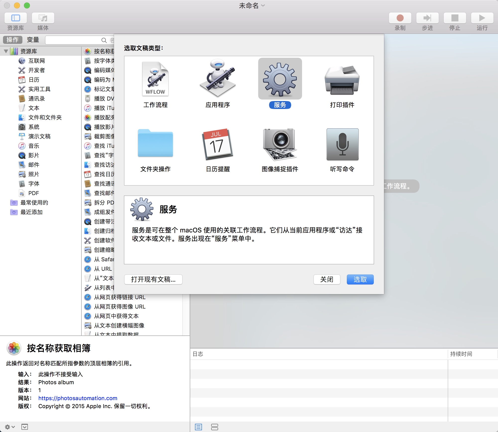
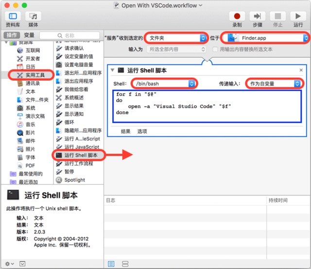
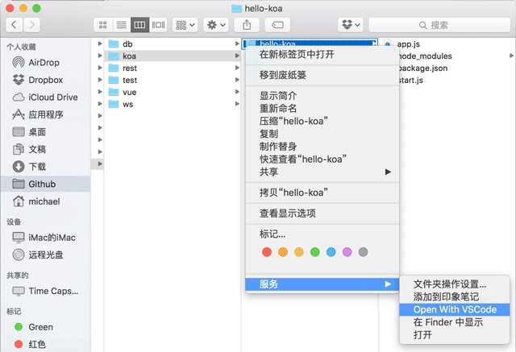
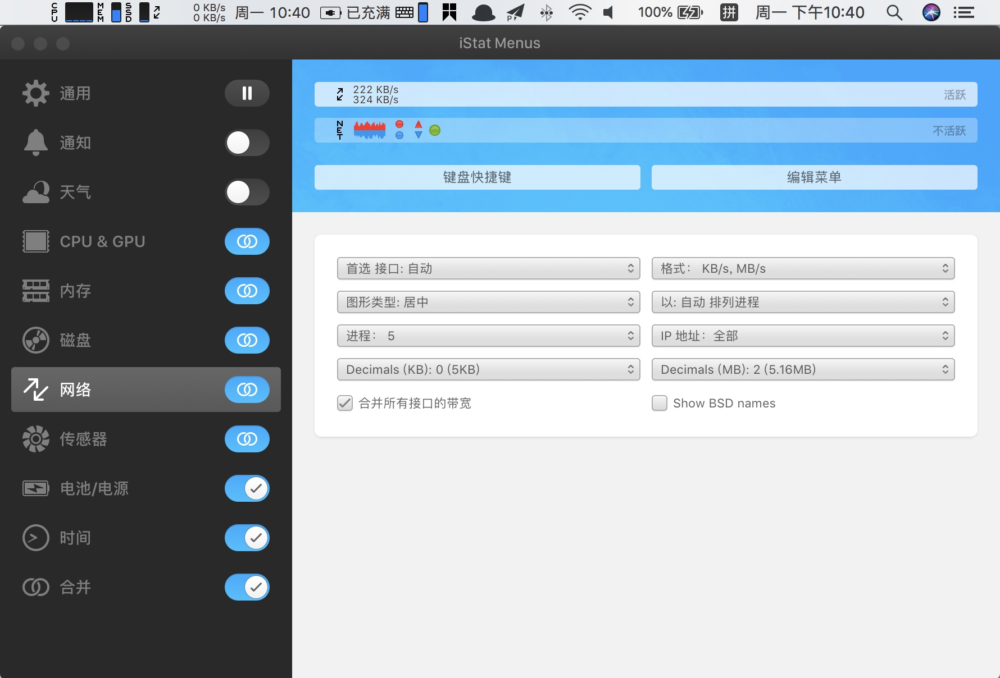
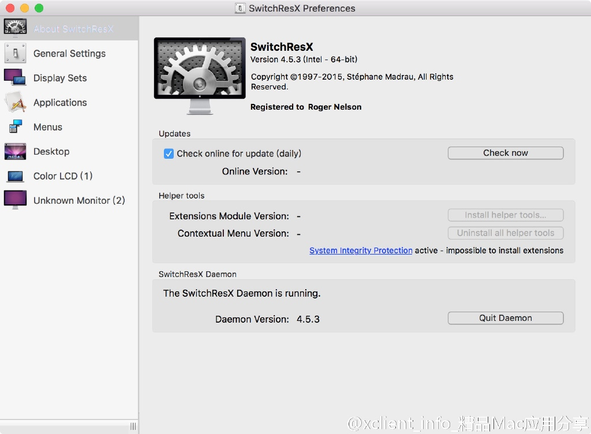
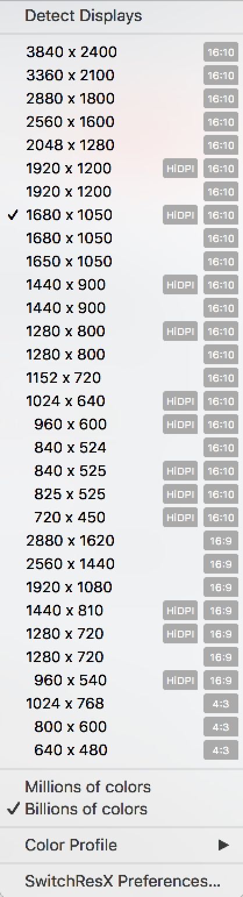
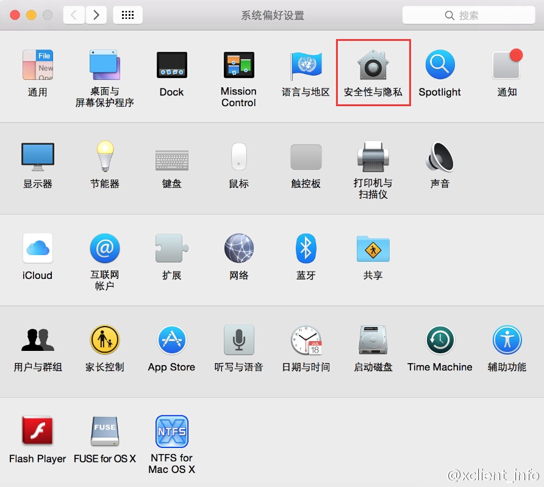
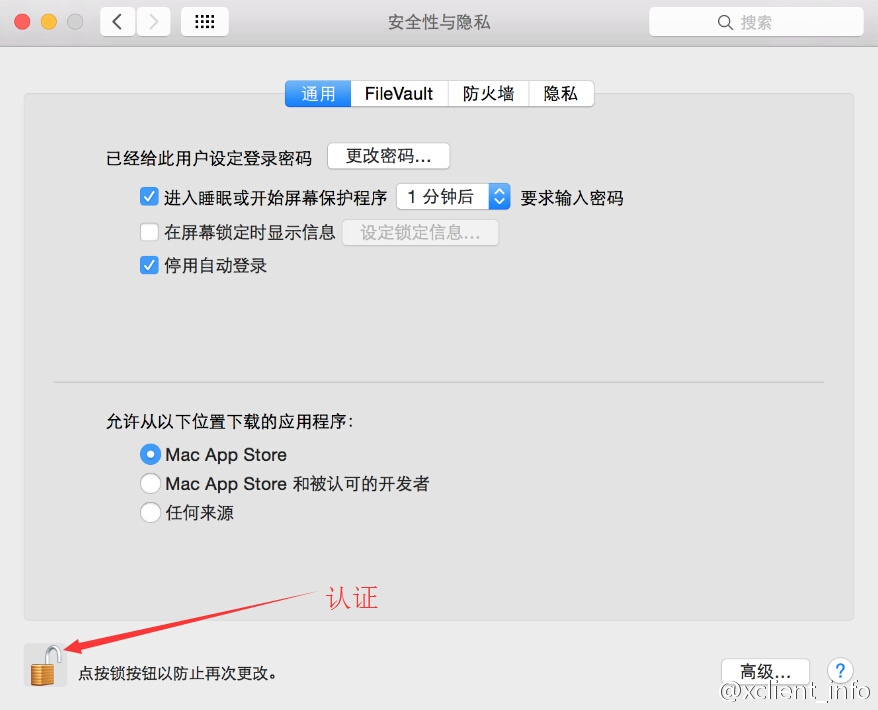
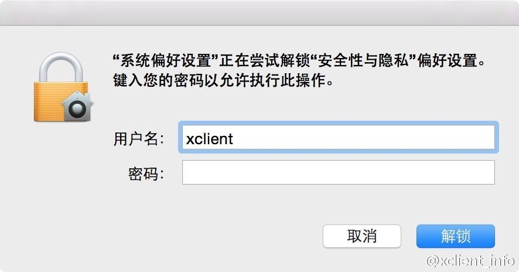
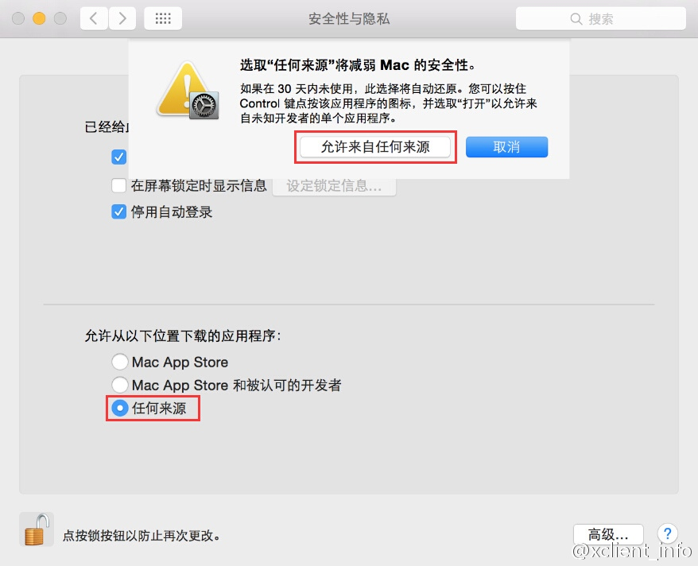

# mac 常用

## 右键添加 vscode 打开代码

- 打开 `Automator` 选择`服务`



- 执行以下操作：



在右侧面板选择`服务`收到选定的`文件夹`，位于`Finder.app`，该选项是为了从`Finder`中接收一个`文件夹`；

在左侧面板选择`实用工具`，然后找到运行`Shell脚本`，把它拽到右侧面板里；

在右侧`运行Shell脚本`的面板里，选择`Shell/bin/bash`，传递输入`作为自变量`，然后修改`Shell`脚本如下：

```shell
for f in "$@"
do
    open -a "Visual Studio Code" "$f"
done
```

- 保存为“Open With VSCode”后，打开Finder，选中一个文件夹，点击右键，“服务”，就可以看到“Open With VSCode”菜单：



## iStat Menus 优秀的系统监控工具

- 下载地址：`http://xclient.info/s/istat-menus-for-mac.html?t=64a5c270c4a7c9777a6a341e2ad66a41c0b0fdc3`

- 解压密码: `xclient.info`



个人主要是为了看`上传/下载`流量

## 显示器分辨率(含外接)

### SwitchResX





下载地址: `http://xclient.info/s/switchresx.html?t=64a5c270c4a7c9777a6a341e2ad66a41c0b0fdc3`

- 解压密码: `xclient.info`

## MAC应用无法打开或文件损坏的处理方法

在 `MAC` 下安装一些软件时提示"来自身份不明开发者"，其实这是 `MAC` 新系统启用了`新的安全机制`。
默认只信任 `Mac App Store` 下载的软件和拥有开发者 `ID` 签名的应用程序。
换句话说就是 MAC 系统默认只能安装靠谱渠道（有苹果审核的 `Mac App Store`）下载的软件或被认可的人开发的软件。


### 出现这个问题的解决方法有2种

- 最简单的方式：按住 `Control` 后，再次点击软件图标，即可。

- 修改系统配置：系统偏好设置... -> `安全性与隐私`。







### 修改为任何来源

- 打开终端，输入`sudo spctl --master-disable` 然后按回车



## 显示隐藏文件/文件夹

- 在终端（`Terminal`）输入如下命令，即可显示隐藏文件和文件夹

```md
defaults write com.apple.finder AppleShowAllFiles -boolean true ; killall Finder
```

- 如需再次隐藏原本隐藏的文件和文件夹，可以输入如下命令

```md
defaults write com.apple.finder AppleShowAllFiles -boolean false ; killall Finder
```