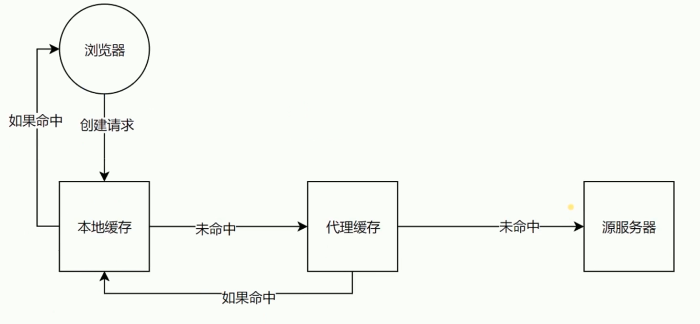

# Cache-Control

### 可缓存性

`public`, 表示所有 `http` 经过的任何地方(代理)都可以缓存

`private`, 只有发起请求的浏览器才可以缓存

`no-cache`, 告诉浏览器、缓存服务器，不管本地副本是否过期，使用资源副本前，一定要到源服务器进行副本有效性校验

`no-cache` 从字面意义上很容易误解为不缓存，但是 `no-cache` 代表不缓存过期的资源，缓存会向服务器进行有效处理确认之后处理资源

### 到期

`max-age=<seconds>`, 缓存到多少秒过期

`s-maxage=<seconds>`, 会代替 `max-age`, 只有在代理服务器才会生效, 浏览器还是会读取 `max-age`

`max-stale=<seconds>`, 发起请求方主动带的头信息, 代表即便缓存已经过期, 在 `max-stale` 设置的时间内还是会读取缓存, 浏览器用不到.

### 重新验证

`must-revalidate`, 设置了 `max-age` 并且已经过期了, 那么会重新发起请求到原服务端获取数据看是否真的过期, 而不是直接使用缓存

`proxy-revalidate`, 同 `must-revalidate` 只不过用在代理服务器上.

### 其他

`no-store`, 永远都要去服务器拿新的内容, `no-store` 才是真正的不进行缓存.

`no-transform`, 用于缓存服务器中, 告诉代理服务器不要随意改动内容

### max-age 演示

当服务器资源更新了, 缓存时间内, 浏览器读取缓存, 不去服务器拿文件:

前端最常见的是更新文件时按文件内容设置 `hash` 类似 `72.63f2ae81.js`, 这样如果文件内容改变, hash 就变化了, 浏览器就会拿到新的文件.

### 扩展阅读

