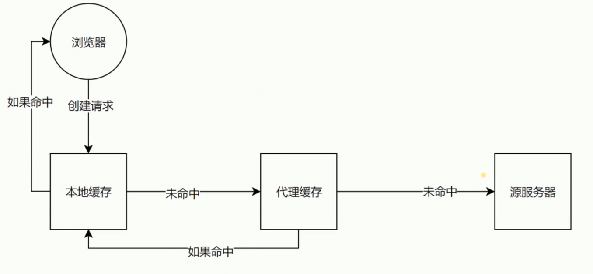
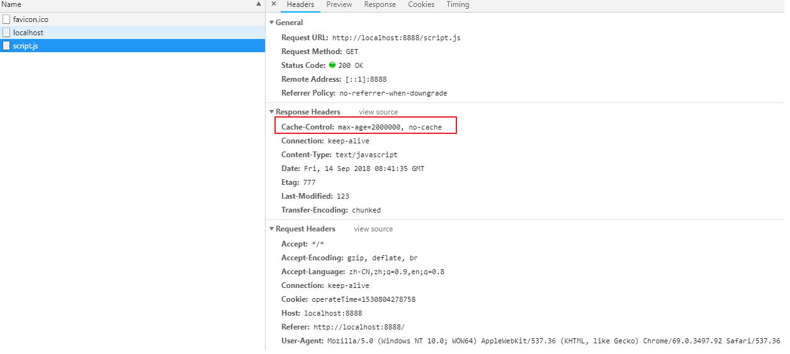
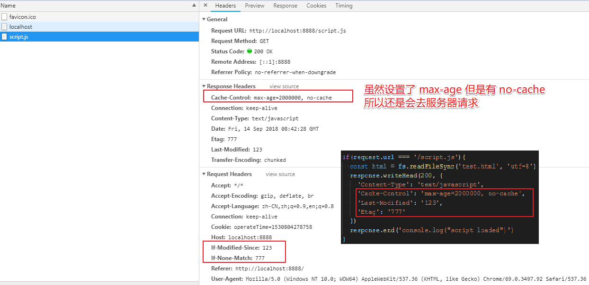

# Last-Modified 和 Etag



### 验证头

- `Last-Modified`

- `Etag`

### Last-Modified

根据上次修改时间

配合 `If-Modified-Since` 或者 `If-Unmodified-Since` 使用

也就是浏览器下次发起请求会带上 `If-Modified-Since` 头信息, 值就是 服务器返回 `Last-Modified` 的值.

对比上次修改时间以验证资源是否需要更新

### Etag

根据数据签名 (常用的是 `hash` 计算)

配合 `If-match` 或者 `If-Non-Match` 使用

也就是浏览器下次发起请求会带上 `If-match`  或者 `If-Non-Match`头信息, 值就是服务器返回的 `Etag` 的值.

对比资源的签名判断是否使用缓存

### 设置





- 设置从缓存读取的话就不重新发送内容

```js
if(request.url === '/script.js'){
  const etag = request.headers['if-none-match']
  if (etag === '777') {
    response.writeHead(304, {
      'Content-Type': 'text/javascript',
      'Cache-Control': 'max-age=2000000, no-cache',
      'Last-Modified': '123',
      'Etag': '777'
    })
    response.end('')
  } else {
    response.writeHead(200, {
      'Content-Type': 'text/javascript',
      'Cache-Control': 'max-age=2000000, no-cache',
      'Last-Modified': '123',
      'Etag': '777'
    })
    response.end('console.log("script loaded")')
  }
}
```