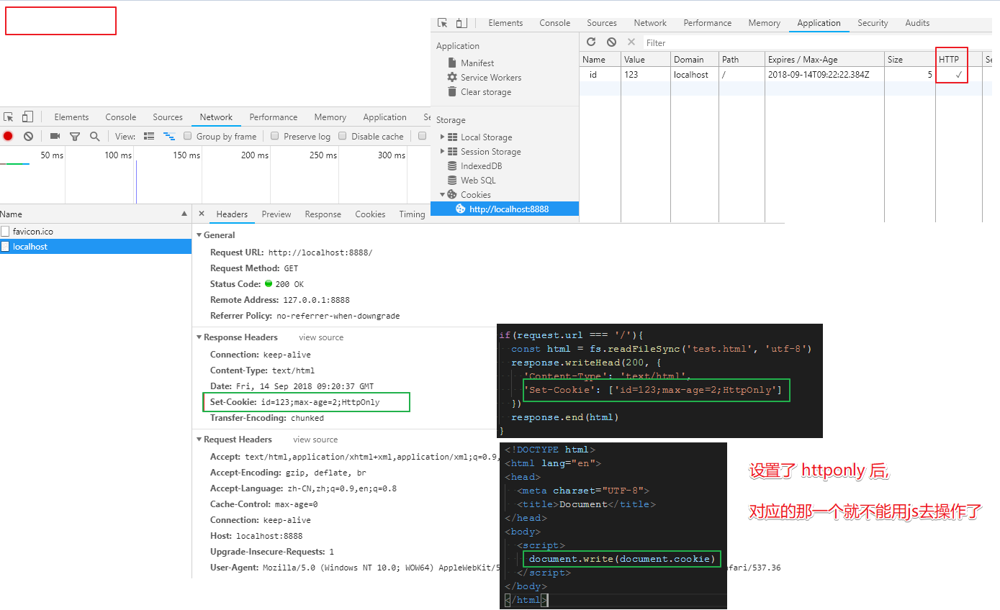

# cookie 和 session

### cookie

服务器通过 `Set-Cookie` 这个 `header` 设置到浏览器里面, 保存在浏览器

下次同域的请求中就会带上这个 `cookie`

键值对, 可以设置多个

### cookie 属性

`max-age` 和 `expires` 设置过期时间

`secure` 只在 `https` 的时候发送

这是 `http-only` 后, 无法通过 `document.cookie` 访问

### cookie 演示

`cookie` 会在浏览器关闭就清除.

第一次访问:


第二次访问:


- 设置过期时间

`'Set-Cookie': ['id=123;max-age=2']`

设置 `http-only` 后:



### cookie domain

`a.com` 下的 `cookie` `b.com` 访问不到.

设置 `domain` 可以让 `test.a.com` 访问到 `a.com` 的 `cookie`.

```js
const http = require('http')
const fs = require('fs')
http.createServer(function (request, response) {
  console.log('request come', request.url)

  const host = request.headers.host

  if(request.url === '/'){
    const html = fs.readFileSync('test.html', 'utf-8')

    if(host === 'test.com'){
      response.writeHead(200, {
        'Content-Type': 'text/html',
        'Set-Cookie': ['id=123;max-age=2;domain=test.com']
      })
    }
    response.end(html)
  }
}).listen(8888)

console.log('server run 8888')
```

### session

`session` 有很多种实现方式, 经常用的是 `cookie` 而已.

比如服务器可以根据 `cookie` 里面的一个唯一 `key` 然后去查用户信息, 只要能定位用户, 就是 `session`.

不一定要 `cookie`, 也可以 `js` 写在 `header` 中.