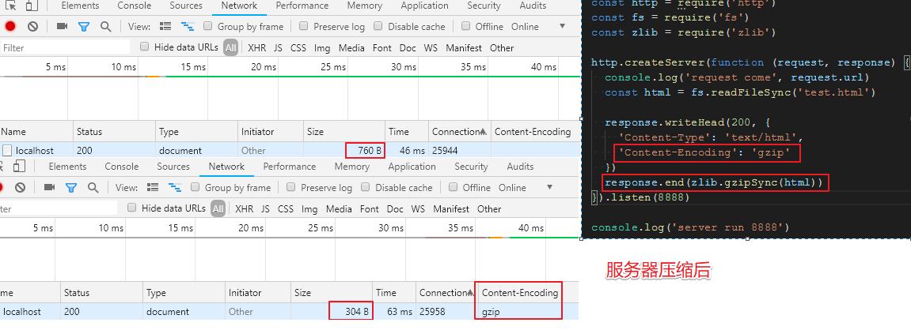

# 数据协商

客户端给服务端发送请求的时候, 客户端会在请求头中声明我希望拿到的数据格式及数据相关的限制是怎样的,

服务端会根据客户端请求, 做出判断, 再具体返回什么.

### 分类

请求 和 返回

### 请求

- `Accept`

`Accept: text/html,application/xhtml+xml,application/xml;q=0.9,image/webp,image/apng,*/*;q=0.8`

指定想要的数据类型(根据 [MIME](https://developer.mozilla.org/zh-CN/docs/Web/HTTP/Basics_of_HTTP/MIME_types) 类型告诉服务端想要什么)

- `Accept-Encoding`

`Accept-Encoding: gzip, deflate, br`

数据的编码方式, 主要是告诉服务端怎样的一个数据压缩(数据压缩算法有很多 gzip, deflate, br 等)

- `Accept-Language`

`Accept-Language: zh-CN,zh;q=0.9,en;q=0.8`

语言, 比如中文, `q` 表示权重

- `User-Agent`

`User-Agent: Mozilla/5.0 (Windows NT 10.0; WOW64) AppleWebKit/537.36 (KHTML, like Gecko) Chrome/69.0.3497.92 Safari/537.36`

`Mozilla/5.0` 网景浏览器的头

`Windows NT 10.0; WOW64` 操作系统版本

`AppleWebKit/537.36` 表示 苹果公司开发的 `WebKit` 内核

`KHTML` 类似 火狐的 `Gecko` 的渲染引擎

`Chrome/69.0.3497.92` 浏览器版本号

`Safari/537.36` 因为是苹果的 `webkit` 内核, 所以会加上这个

浏览器相关的信息, 移动端还是 PC.

### 返回

- `Content-Type`

对应请求中的 `Accept`, `Accept` 可以有很多种类型, `Content-Type` 可以从里面选择一种返回

可以设置 `X-Content-Type-Options: nosniff`, 禁止浏览器根据内容去预测类型, 为了安全性.

- `Content-Encoding`

对应 `Accept-Language`

- `Content-Language`

对应 `Accept-Language`

服务端不返回 `User-Agent`

数据在整个传输过程中大小: 包含 `http` `headers` 和 `body` 和首行信息

数据拿到后并且根据 `Content-Encoding` 解压后的 `body` 实际内容大小, 不是 传输里面的 `body` 大小

### gzip 案例



### MIME 类型

- `application/x-www-form-urlencoded`

```html
<form action="/form" method="post" enctype="application/x-www-form-urlencoded">
  <input type="text" name="name">
  <input type="password" name="password">
  <input type="submit">
</form>
```

请求头:

```js
Content-Type: application/x-www-form-urlencoded
```

```js
name=1&password=1
```

- `multipart/form-data`

`multipart/form-data` 表示把表单拆成多个部分, 因为经常有文件操作, 文件不能当做字符串传输, 它要作为二进制传输.

```html
<form action="/form" method="post" enctype="multipart/form-data">
  <input type="text" name="name">
  <input type="password" name="password">
  <input type="submit">
</form>
```

请求头:

```js
Content-Type: multipart/form-data; boundary=----WebKitFormBoundaryIyBOcYI2n3gyM9IQ

// ----WebKitFormBoundaryIyBOcYI2n3gyM9IQ 用来分隔表单每一项
```

```js
------WebKitFormBoundaryIyBOcYI2n3gyM9IQ
Content-Disposition: form-data; name="name"

3
------WebKitFormBoundaryIyBOcYI2n3gyM9IQ
Content-Disposition: form-data; name="password"

4
------WebKitFormBoundaryIyBOcYI2n3gyM9IQ
Content-Disposition: form-data; name="file"; filename="url-tcp.png"
Content-Type: image/png


------WebKitFormBoundaryIyBOcYI2n3gyM9IQ--
```

### 实例代码

`test.html`:

```html
<!DOCTYPE html>
<html lang="en">
<head>
  <meta charset="UTF-8">
  <title>Document</title>
</head>
<body>
  <form action="/form" id="form" method="post" enctype="multipart/form-data">
    <input type="text" name="name">
    <input type="password" name="password">
    <input type="file" name="file">
    <input type="submit">
  </form>
  <script>
   var form = document.getElementById('form')
   form.addEventListener('submit', function (e) {
     e.preventDefault()
     var formData = new FormData(form)
     fetch('/form',{
       method: 'POST',
       body: formData
     })
   })
  </script>
</body>
</html>
```

`server.js`:

```js
const http = require('http')
const fs = require('fs')
const zlib = require('zlib')

http.createServer(function (request, response) {
  console.log('request come', request.url)
  const html = fs.readFileSync('test.html')

  response.writeHead(200, {
    'Content-Type': 'text/html',
    'Content-Encoding': 'gzip'
  })
  response.end(zlib.gzipSync(html))
}).listen(8888)

console.log('server run 8888')
```