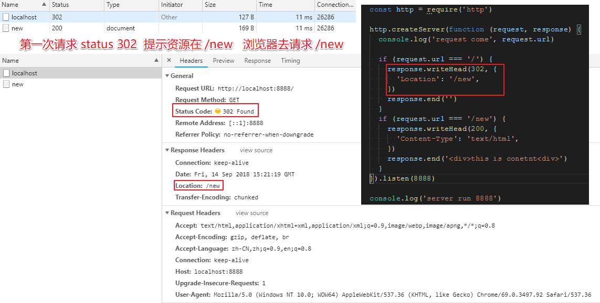
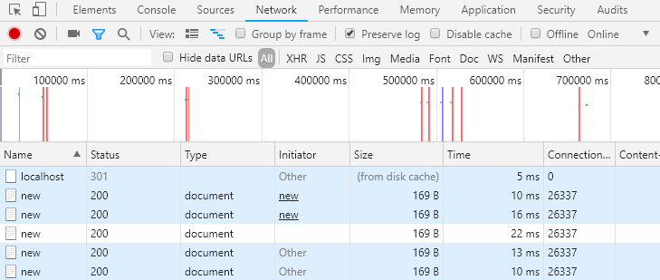

# Redirect

服务器告诉浏览器你要的资源在什么地方, 浏览器重新请求新的地址

### 302 临时跳转

- `server.js`

```js
const http = require('http')

http.createServer(function (request, response) {
  console.log('request come', request.url)

  if (request.url === '/') {
    response.writeHead(302, {
      'Location': '/new',
    })
    response.end('')
  }
  if (request.url === '/new') {
    response.writeHead(200, {
      'Content-Type': 'text/html',
    })
    response.end('<div>this is conetnt<div>')
  }
}).listen(8888)

console.log('server run 8888')
```



### 301 永远跳转

```js
response.writeHead(301, {
  'Location': '/new',
})
```

只有第一次是 `301`, 以后每次否是请求最新的了. 直接在浏览器变成新的路径, 不需要再去服务器指定新的 `location`.

`from disk` 已经存到浏览器了.



注意: `301` 不会主动失效, 只有当用户清除缓存才行.