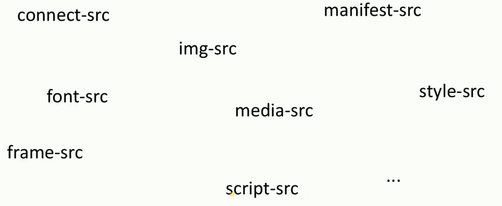
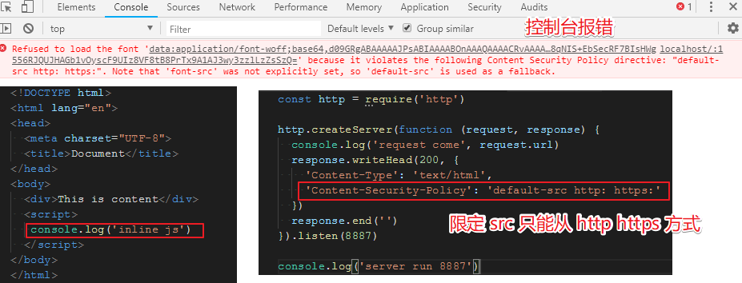
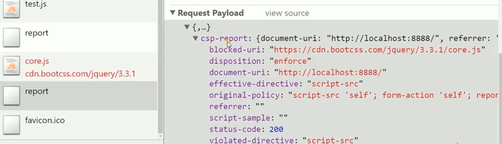

# Content-Security-Policy

[内容安全策略](https://developer.mozilla.org/zh-CN/docs/Glossary/CSP)

### 作用

限制资源获取

报告资源获取越权

### 限制方式

- `default-src`

全局限制

- 指定资源类型





### 限制只能外链

```js
'Content-Security-Policy': 'default-src http: https:'
```

### 限制只能加载本站点脚本

```js
'Content-Security-Policy': 'default-src \'self\''
```

### 限制 form 为本站

```js
'Content-Security-Policy': 'default-src \'self\'; form-action \'self\''
```

### 只限制 script

```js
'Content-Security-Policy': 'script-src \'self\''
```

### 上报路径

如果触发 `CSP` 则请求 上报接口

```js
'Content-Security-Policy': 'script-src \'self\'; report-uri /repoert'
```



设置是上报, 但是给他加载资源:

```js
'Content-Security-Policy-Report-Only': 'script-src \'self\'; report-uri /repoert'
```

### html 中设置 meta 和服务端设置 header 都行

`report-uri` 需要在 `header` 才能设置.

```html
<head>
  <meta charset="UTF-8">
  <title>Document</title>
  <meta http-equiv="Content-Security-Policy" content="script-src 'self'; form-action 'self'" >
</head>
```
