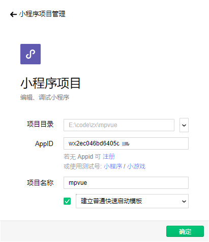

# 安装开发者工具

### 小程序帐号注册

[官方小程序简易教程](https://developers.weixin.qq.com/miniprogram/dev/)

### 安装微信开发者工具

点击 [微信开发者工具](https://developers.weixin.qq.com/miniprogram/dev/devtools/download.html) 下载对应版本.

### 初始化项目

[登录小程序](https://mp.weixin.qq.com) -> 设置 -> 开发设置, 找到 `AppID(小程序ID)`.

