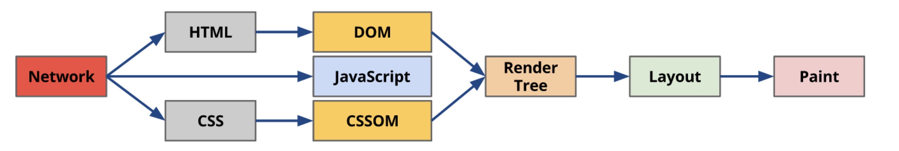

# 浏览器渲染原理

1、首先渲染引擎下载HTML，解析生成DOM Tree

2、遇到css标签或JS脚本标签就新起线程去下载他们，并继续构建DOM。（其中css是异步下载同步执行）浏览器引擎通过 DOM Tree 和 CSS Rule Tree 构建 Rendering Tree

3、 通过 CSS Rule Tree 匹配 DOM Tree 进行定位坐标和大小，这个过程称为 Flow 或 Layout 。

4、最终通过调用Native GUI 的 API 绘制网页画面的过程称为 Paint 。

当用户在浏览网页时进行交互或通过 js 脚本改变页面结构时，以上的部分操作有可能重复运行，此过程称为 Repaint 或 Reflow。 重排是指dom树发生结构变化后，需要重新构建dom结构。 重绘是指dom节点样式改变，重新绘制。 重排一定会带来重绘，重绘不一定有重排。

如何减少浏览器重排：将需要多次重排的元素，position属性设为absolute或fixed，这样此元素就脱离了文档流，它的变化不会影响到其他元素。

