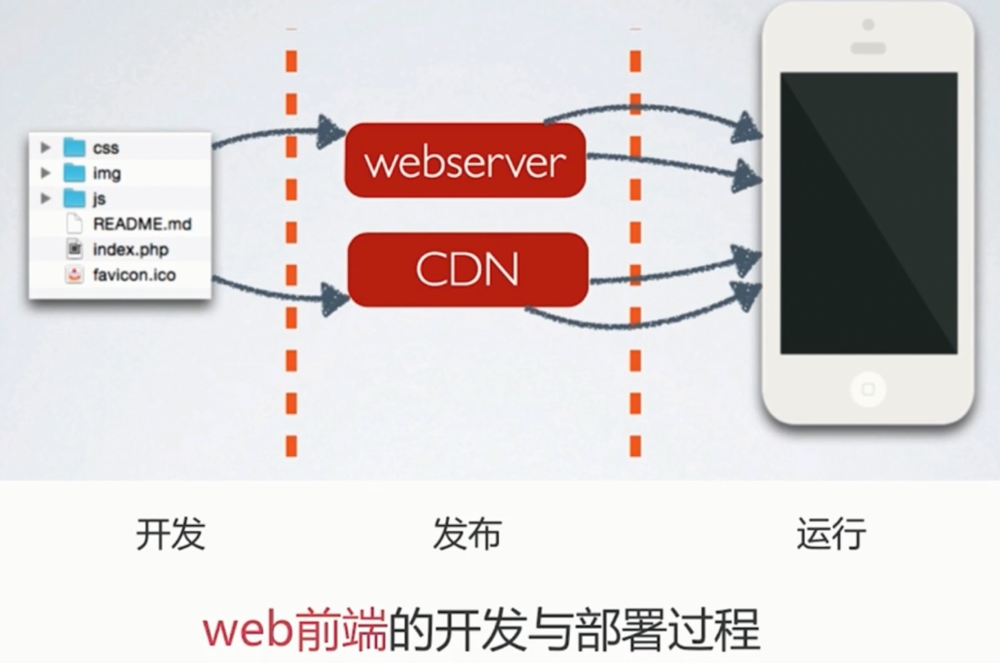
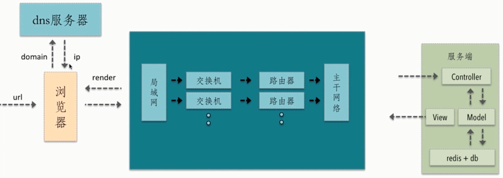
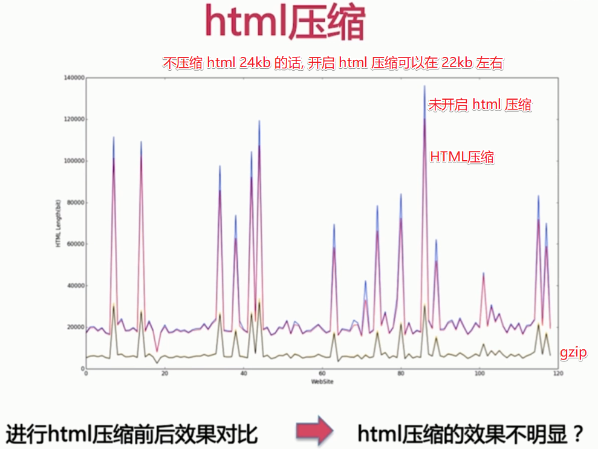
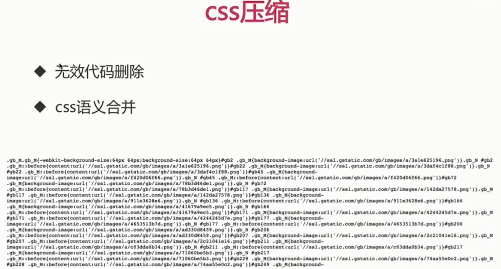
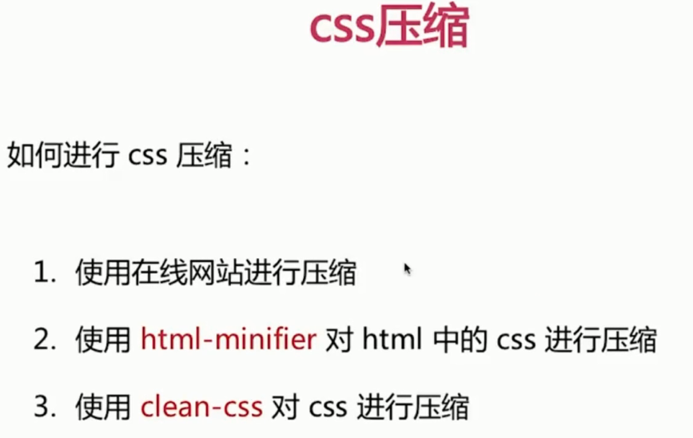
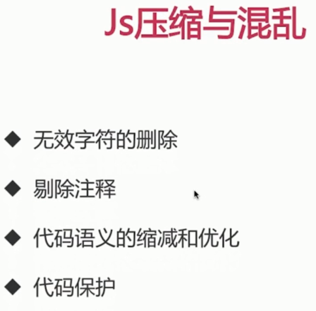
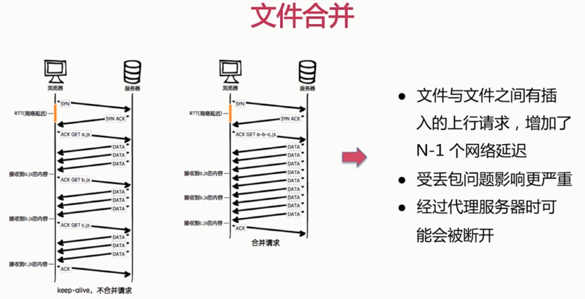
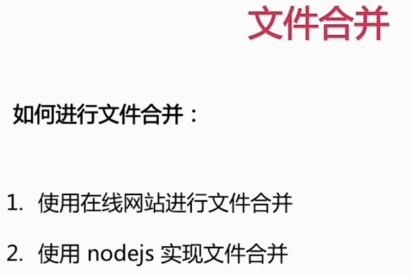
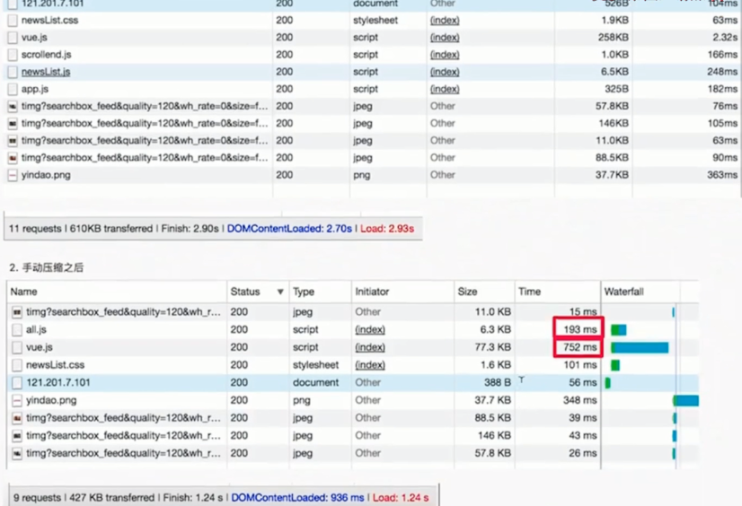

# 资源的合并与压缩

- 理解 `减少 http 请求数量` 和 `减少请求资源大小` 两个优化要点

- 掌握压缩与合并的原理

- 掌握通过 `在线网站` 和 `fis3` 两种实现压缩与合并的方法

### Web 前端

### 浏览器的一个请求从发送到返回都经历了什么

### 请求过程中一些潜在的优化点

- `DNS` 是否可以通过缓存减少 `DNS` 查询时间

- 网络请求的过程走最近的网络环境

- 相同的静态资源是否可以缓存

- 能否减少请求 `HTTP` 请求大小

- 减少 `HTTP` 请求

- 服务端渲染

### 深入理解 HTTP 请求的过程是前端性能优化的核心

### 资源的合并与压缩

- 减少 `HTTP` 请求的数量

- 减小 `HTTP` 请求的大小

### html 压缩

### css 压缩

### js 的压缩和混乱

### 文件合并

### 开启 gzip

### html css js 压缩前后对比

做了 `html` `css` `js` 压缩, `js` 合并后:

从 `2.90S` 降低到 `1.24S`, `610KB` 减少到 `427KB`, `11` 个请求减少到 `9`个请求(合并了下业务JS).

### 资源的合并与压缩总结

