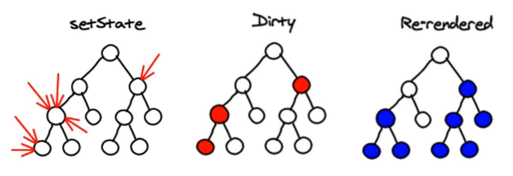
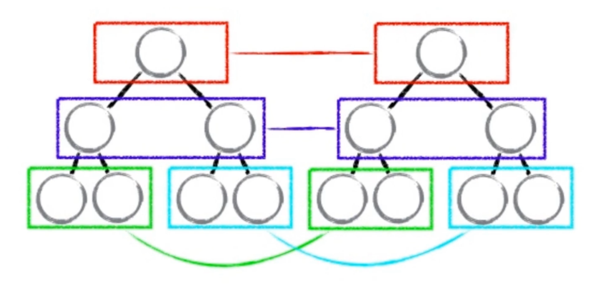
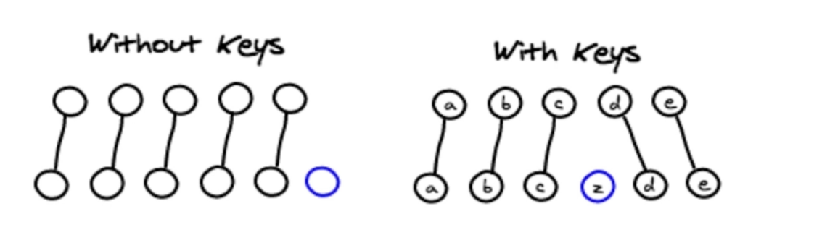

# 虚拟 DOM 中的 Diff 算法

**diff (difference)**

- `setState` 的异步

`React` 中 `setState` 是异步的(不会立马生效), `比如短时间多次更改同一个state`, 会一起更改, 提升性能.

- `diff` 同级比较

JS **同层** 逐层比较, 如果该层不一样, 则该层之下的不再比较, 全部替换为新的, 比对速度快!

- `虚拟 DOM` 的 `key`

如果虚拟 `DOM` 设置了 `key`, 则只会比对不一样的 `key`.

::: warning
在循环中不要设置 `key` 为 `index`, 因为无法保证 原始虚拟 DOM `key` 和 新的 虚拟 DOM  的 `key` 一致, 失去了 `key` 用来减少比对的意义, 能不用 `index` 做 `key` 就不用. 用稳定的唯一内容做 `key` 如 `item`.
:::