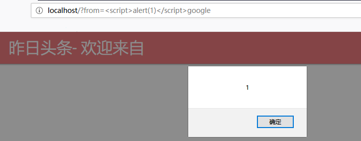
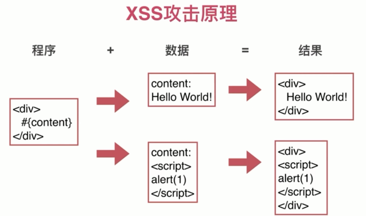
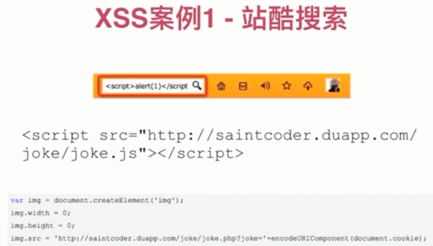
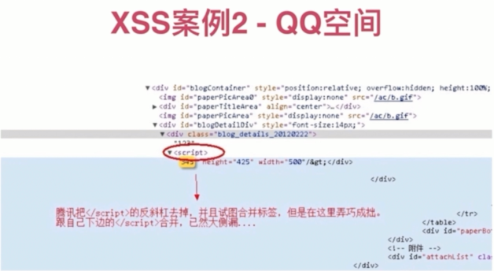
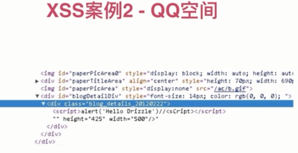
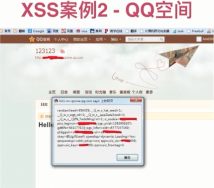
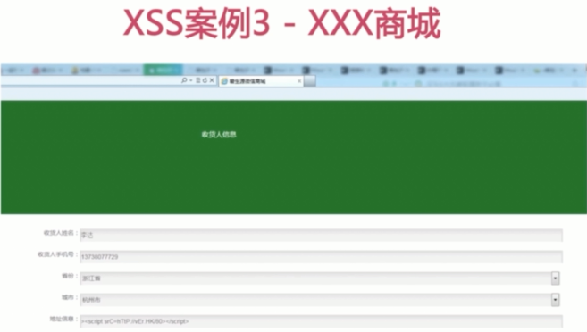
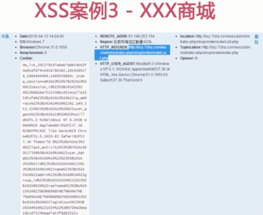
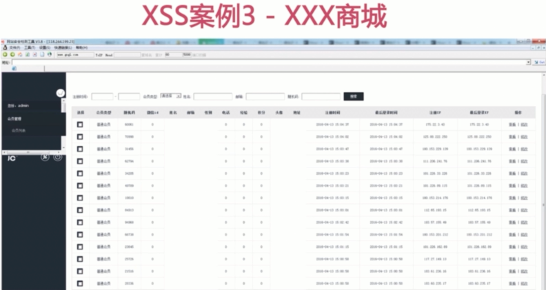

# XSS

`Cross Site Scripting`, 卷跨站脚本攻击

### 演示

`http://localhost/?from=google`

`http://localhost/?from=google`, 在 `firefox` 有效.

> Chrome 在此网页上检测到了异常代码。为保护您的个人信息（例如密码、电话号码和信用卡信息），Chrome 已将该网页拦截

### Scripting 能做什么

- 获取页面数据

- 获取 `Cookies`

`Cookies` 含有很多敏感信息

- 劫持前端逻辑

比如按钮点击逻辑

- 发送请求

图片、form 等手段发送到攻击者

- 偷取网站任意数据

- 偷取用户资料

- 偷取用户密码和登录态

- 欺骗用户

### 案例

