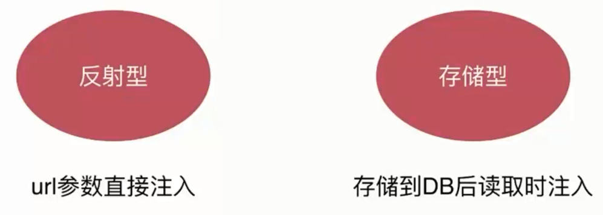
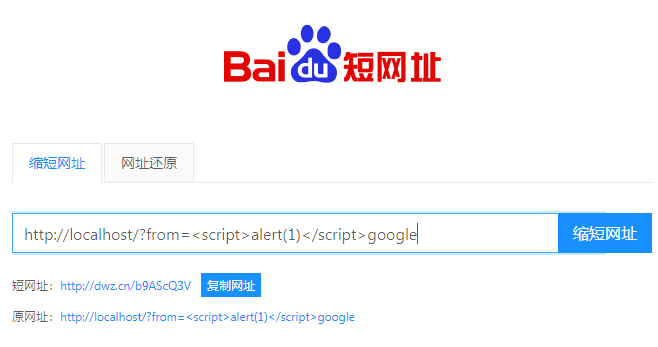
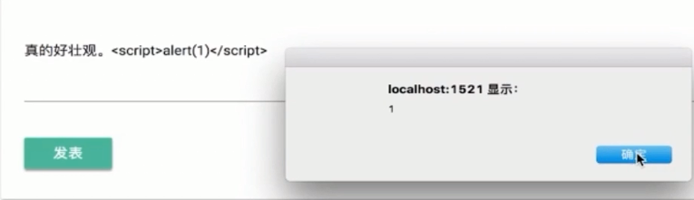
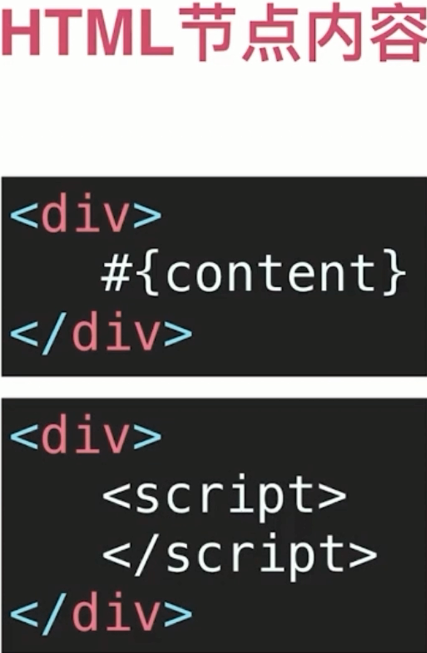
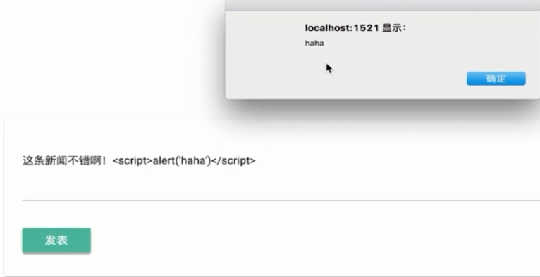
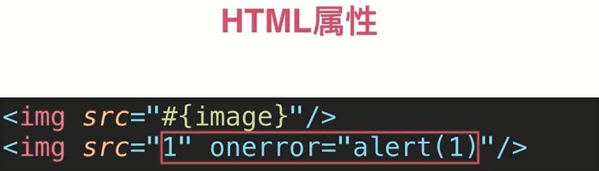
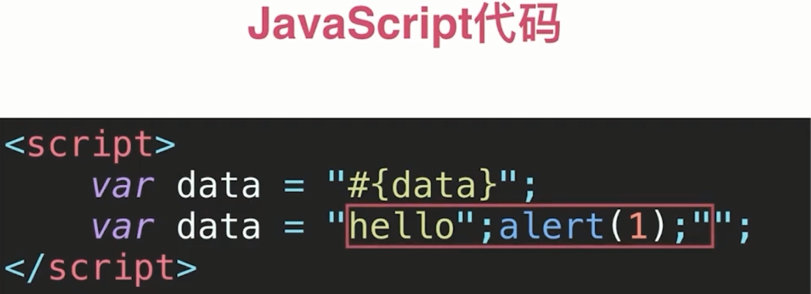

# XSS 攻击分类



### 反射型演示

`http://localhost/?from=<script>alert(1)</script>google`


攻击手段:

需要把网址发送给别人, 但是别人一看链接就会怀疑, 所以可以生产短网址, 再发送给别人



### 存储型演示

提交评论, 脚本保存到数据库, 用户访问这条评论就执行了脚本.



### XSS 攻击注入点

- HTML 节点内容





- HTML 属性



```bash
地址栏访问: `localhost/?avatarId=1` 得到的 `HTML` 是 ``

修改地址栏访问 `localhost/?avatarId=1" onerror="alert(1)` 得到的 `HTML` 是 ``
```

原理:

把 `" onerror="alert(1)` 加到了 `` 中 `1` 的后面

结果是 ``

- JavaScript 代码



- 富文本

- 富文本得保留 `HTML`

- `HTML` 有 `XSS` 攻击风险