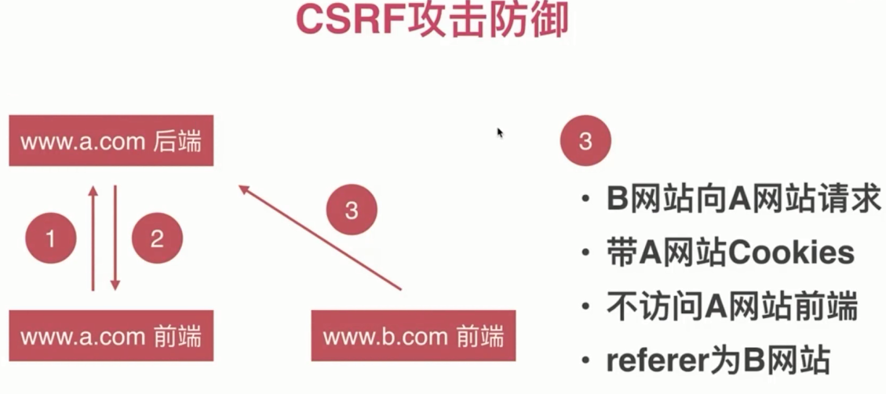
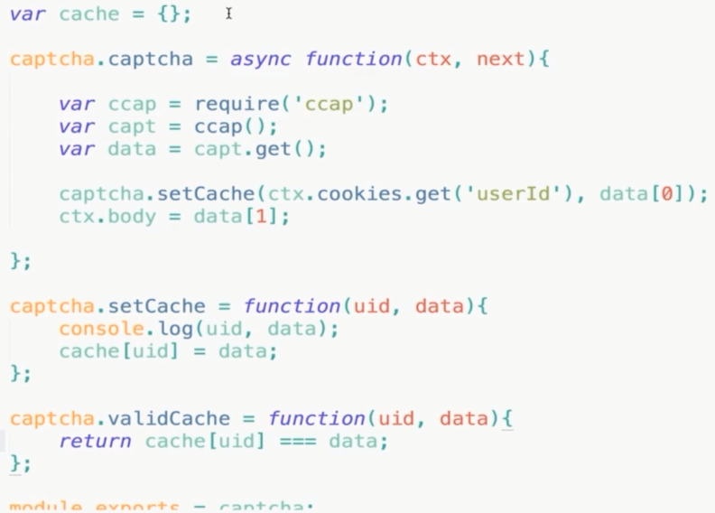

# CSRF 攻击防御



- 禁止第三方网站带 Cookies

- [same-site](https://developer.mozilla.org/en-US/docs/Web/HTTP/Headers/set-cookie) 属性很好用, 但是兼容性不是很好

```bash
Set-Cookie: <cookie-name>=<cookie-value>; SameSite=Strict
Set-Cookie: <cookie-name>=<cookie-value>; SameSite=Lax
```

### 不访问 A 网站前端

- 在前端页面加入验证信息

- 验证码

`node` 中用 `ccap` 库 生成图形验证码.



- token

就是随机的字符串.

### referer 为 B 网站

- 验证 referer

`ctx.request.headers.referer`

- 禁止来自第三方网站请求