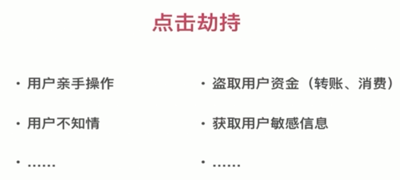
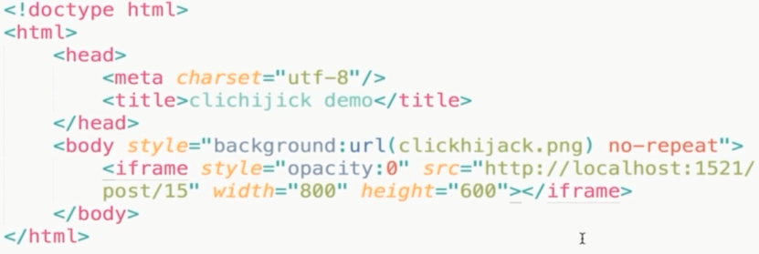

# 点击劫持

一般是嵌套 `iframe`, 然后设置透明, 诱导用户点击.





### 点击劫持防御

```js
if(top.location != window.location) {
  top.location = window.location
}
```

上面的情况如果给 iframe 设置 `sandbox="allow-forms"` 属性则可以继续发起表单请求.

- JavaScript 禁止内嵌

- X-FRAME-OPTIONS 禁止内嵌

```js
ctx.set('X-Frame-Options', 'DENY')
```

- 其他辅助手段

比如验证码