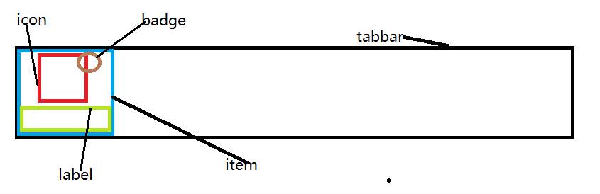
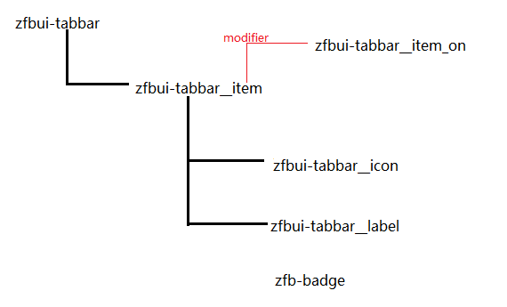

# BEM 命名规范

`BEM` 的意思就是`块（block）`、`元素（element）`、`修饰符（modifier）`,是由 Yandex 团队提出的一种前端命名方法论，是一种 CSS 命名规范.

我们来看一个例子 `zfbui-tabbar__item`, 从这个名字我们能够解读出 **支付宝界面** **标签栏** **项**, 然后还能读取出他们的之间相应的结构.

- 在命名中就赋予他们更多的意义，并且体现了他们的关系。这恰恰就让你的代码更为友好，更加容易维护。
- 此外，命名变长后，他的命名同时也就变得更加的特殊，在上下文中更加稳定，不会干扰其他组件的样式也就是提高了组件的独立性。
- 而且在写 CSS 样式时能够直接找到类名。

**这里再详细的介绍一下 BEM**:

`B(blcok)`: 也就是块的概念，也可以叫做组件，模块。

> 页面是由多个组件一起拼接而成，他们相互独立，互不干扰。在现代开发中项目中大部分都是由通用组件构成。

`E(element)`: 元素

> 他在块中承担的职责（唯一性的名字），并不是简单的父子关系, 如：zfbui-tabbar__item_on  `这里要注意是两个下划线__`

`M(modifier)`:修饰符

> 也就是状态的修改。它不能单独使用，一定要依赖于块或元素, 如： __item_on (一个下划线)

**下面我们来分析支付宝界面的 TarBar**:


很显然这个tabbar是一个块，很明显的区分了5个项，能够发现每个项他都是由三个元素组成。
这样我们就可以先给他们取好独立的名字：

```md
项     item
图标    icon  
标签    label  
小红点   badge
```

那我们命名完成了，那我们再来梳理一下他们的结构



在上图中我们可以很清晰的看到他们的结构 于是我们可以构建出 BEM 树状图：



这个时候用BEM把他们规范后：

```md
zfbui-tabbar__item
zfbui-tabbar__icon
zfbui-tabbar__label
zfbui-badge（由于这个badge在页面的其他组件没有使用且比较特殊故可简化）
```

在一个 item 被选中时我们发现他是蓝色的与其他 item 不同，在 BEM 规范中，对于 **元素状态** 的修改我们可以用 `zfbui-tabbar__item_on` 来修饰，这是使用 `Modifier` 的一个真实场景。