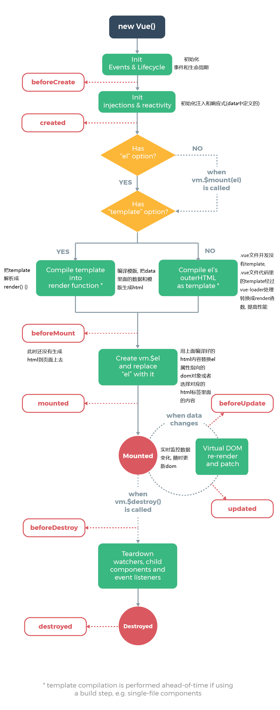

# Vue 的生命周期

```js
import Vue from 'vue'

const app = new Vue({
  // el: '#root',
  // template: '<div>{{text}}</div>',
  data: {
    text: 0
  },
  beforeCreate () {
    console.log(this.$el, 'beforeCreate')
  },
  created () {
    console.log(this.$el, 'created')
  },
  beforeMount () {
    console.log(this.$el, 'beforeMount')
  },
  mounted () {
    console.log(this.$el, 'mounted')
  },
  beforeUpdate () {
    console.log(this, 'beforeUpdate')
  },
  updated () {
    console.log(this, 'updated')
  },
  activated () {
    console.log(this, 'activated')
  },
  deactivated () {
    console.log(this, 'deactivated')
  },
  beforeDestroy () {
    console.log(this, 'beforeDestroy')
  },
  destroyed () {
    console.log(this, 'destroyed')
  },
  render (h) {
    throw new TypeError('render error')
    // console.log('render function invoked')
    // return h('div', {}, this.text)
  },
  renderError (h, err) {
    return h('div', {}, err.stack)
  },
  errorCaptured () {
    // 会向上冒泡，并且正式环境可以使用
  }
})


app.$mount('#root')
setInterval(() => {
  app.text = app.text += 1
}, 1000)

setTimeout(() => {
  app.$destroy()
}, 1000)
```

- `beforeCreate` 和 `created` 始终都会执行, **服务端渲染只有这两个生命周期, 因为没有 DOM**.

- 当不指定 `el: '#root'` 不会触发 `beforeMount` 和 `mounted`, 指定 `el: '#root'` 或者手动挂载 `app.$mount('#root')` 会触发这两个方法.

- 案例中 `app.text` 的数据改变时触发 `beforeUpdate` 和 `updated`.

- `activated` 和 `deactivated` 是组件 `keep-alive` 组件激活和停用时调用.

- `beforeDestroy` 和 `destroyed` 是 `$destroy` 销毁时触发.

- `renderError` 只有在 **开发时** 才会被调用, 用于调试 `render` 函数的错误, 只限于本组件, 不包含子组件.

- `errorCaptured` 会向上冒泡，并且 **正式环境** 可以使用, 所有子组件都可以捕获到.



- `beforeCreate`

在实例初始化之后，数据观测(`data observer`) 和 `event/watcher` 事件配置之前被调用。

- `created`

实例已经创建完成之后被调用。在这一步，实例已完成以下的配置：数据观测(`data observer`)，属性和方法的运算，`watch/event` 事件回调。然而，挂载阶段还没开始，`$el` 属性目前不可见。

- `render`

`render` 函数接受一个参数 `h`, `h` 就是 `createElement`, `h('div', {}, this.text)` 表示创建一个 `div`, `{}` 是元素上面的一些属性, `this.text` 是元素中的内容.

```js
render (h) {
  return h('div', {}, this.text)
}
```

- `beforeMount`

在挂载开始之前被调用：相关的 `render` 函数首次被调用。

- `mounted`

el 被新创建的 `vm.$el` 替换，并挂载到实例上去之后调用该钩子。如果 `root` 实例挂载了一个文档内元素，当 `mounted` 被调用时 `vm.$el` 也在文档内。

- `beforeUpdate`

数据更新时调用，发生在虚拟 `DOM` 重新渲染和打补丁之前。 你可以在这个钩子中进一步地更改状态，这不会触发附加的重渲染过程。

- `updated`

由于数据更改导致的虚拟 `DOM` 重新渲染和打补丁，在这之后会调用该钩子。

当这个钩子被调用时，组件 `DOM` 已经更新，所以你现在可以执行依赖于 `DOM` 的操作。然而在大多数情况下，你应该避免在此期间更改状态，因为这可能会导致更新无限循环。

该钩子在服务器端渲染期间不被调用。

- `beforeDestroy`

实例销毁之前调用。在这一步，实例仍然完全可用。

- `destroyed`

`Vue` 实例销毁后调用。调用后，`Vue` 实例指示的所有东西都会解绑定，所有的事件监听器会被移除，所有的子实例也会被销毁。 该钩子在服务器端渲染期间不被调用。

### 参考链接

- [Vue 生命周期](https://www.cnblogs.com/fly_dragon/p/6220273.html), by 老马
