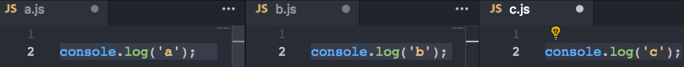
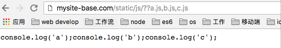

# 合并请求

前端性能优化中重要一点就是尽量减少 `http` 资源请求的数量。通过 `nginx-http-concat` 模块（淘宝开发的第三方模块，需要单独安装）用一种特殊的请求 `url规则`（例子：`example.com/??1.js,2.js,3.js` ），前端可以将多个资源的请求合并成一个请求，后台Nginx会获取各个资源并拼接成一个结果进行返回。

例如上面的例子通过一个请求将 `1.js`,`2.js`,`3js` 三个 js 资源合并成一个请求，减少了浏览器开销。

本地 `server` `mysite-base.com` 为例，`static/js` 文件夹下有三个文件，文件内容很简单，分别为：



Nginx 配置如下：

```bash
# js资源http-concat
# nginx-http-concat模块的参数远不止下面三个，剩下的请查阅文档
location /static/js/ {
  concat on; # 是否打开资源合并开关
  concat_types application/javascript; # 允许合并的资源类型
  concat_unique off; # 是否允许合并不同类型的资源
  concat_max_files 5; # 允许合并的最大资源数目
}
```

当在浏览器请求 `http://mysite-base.com/static/js/??a.js,b.js,c.js` 时，发现三个 `js` 被合并成一个返回了，如下图：



[Nginx与前端开发](https://juejin.im/post/5bacbd395188255c8d0fd4b2), by ccfe.