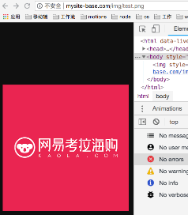

# 图片处理

在前端开发中，经常需要不同尺寸的图片。

现在的云储存基本对图片都提供有处理服务（一般是通过在图片链接上加参数）。

其实用Nginx，可以通过几十行配置，搭建出一个属于自己的本地图片处理服务，完全能够满足日常对图片的裁剪/缩放/旋转/图片品质等处理需求。

要用到 `ngx_http_image_filter_module` 模块。这个模块是非基本模块，需要安装。

下面是`图片缩放功能`部分的 Nginx 配置：

```bash
# 图片缩放处理
# 这里约定的图片处理url格式：以 mysite-base.com/img/路径访问
location ~* /img/(.+)$ {
  alias /Users/cc/Desktop/server/static/image/$1; #图片服务端储存地址
  set $width -; #图片宽度默认值
  set $height -; #图片高度默认值
  if ($arg_width != "") {
    set $width $arg_width;
  }
  if ($arg_height != "") {
    set $height $arg_height;
  }
  image_filter resize $width $height; #设置图片宽高
  image_filter_buffer 10M;   #设置Nginx读取图片的最大buffer。
  image_filter_interlace on; #是否开启图片图像隔行扫描
  error_page 415 = 415.png; #图片处理错误提示图，例如缩放参数不是数字
}
```

根据 url 请求不同的图片大小返回



这里只是最基本的配置。此外，可以通过 `proxy_cache` 配置 `Nginx缓存`，避免每次请求都重新处理图片，减少 Nginx 服务器处理压力；还以可以通过和 `nginx-upload-module` 一起使用加入图片上传的功能等。

[Nginx与前端开发](https://juejin.im/post/5bacbd395188255c8d0fd4b2), by ccfe.