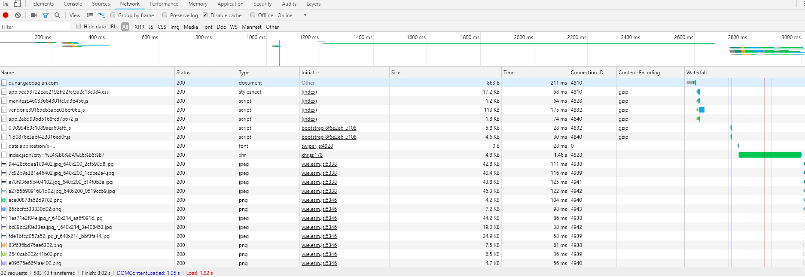
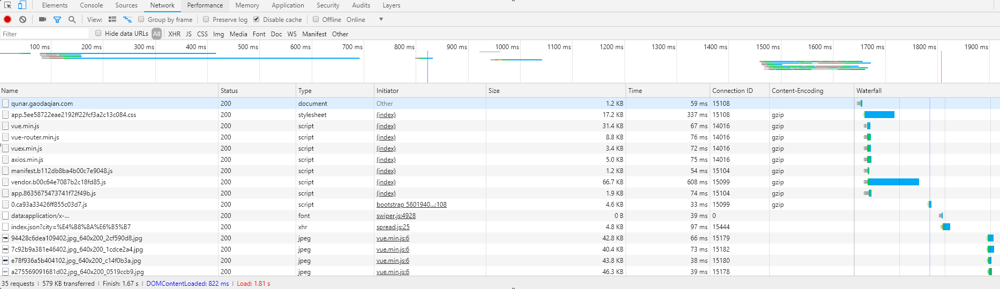

# 使用 CDN 引入库文件

主要涉及到以下几个文件的小修改:

- `package.json`
- `config/index.js`
- `build/webpack.base.conf.js`
- `build/webpack.dev.conf.js`
- `build/webpack.prod.conf.js`
- `index.html`
- `main.js`

### package.json

卸载依赖包, 你需要什么走 `CDN` 就卸载什么:

```bash
npm uninstall axios element-ui vue vue-router vuex
```

### config/index.js

在 `config/index.js` 中新增 `cdn` 对象, 设置引入库的 `CDN` 地址, 由你自己去选, 这里只是举例:

```js
//...
module.exports = {
  dev: {
    // 这里不变
  },
  build:{
    // 这里不变
  },
  cdn: {
    css: [
      "https://unpkg.com/element-ui/lib/theme-chalk/index.css",
      // "https://cdn.jsdelivr.net/npm/swiper@4.4.1/dist/css/swiper.css",
    ],
    js: [
      "https://cdn.jsdelivr.net/npm/vue@2.5.17/dist/vue.min.js",
      "https://cdn.jsdelivr.net/npm/vue-router@3.0.1/dist/vue-router.min.js",
      "https://cdn.jsdelivr.net/npm/vuex@3.0.1/dist/vuex.min.js",
      "https://cdn.jsdelivr.net/npm/axios@0.18.0/dist/axios.min.js",
      "https://unpkg.com/element-ui/lib/index.js",
      // "https://cdn.jsdelivr.net/npm/vue-awesome-swiper@2.6.7/dist/vue-awesome-swiper.min.js",
    ]
  }
}
```

### build/webpack.base.conf.js

在 `build/webpack.base.conf.js` 中新增 `externals` 对象:

```js
module.exports = {
  entry: {
    // 其他不变
  },
  externals: {
    'vue': 'Vue',
    'vue-router': 'VueRouter',
    'vuex': 'Vuex',
    'axios':'axios'
    // 'element-ui':'ELEMENT',
  }
}
```

### webpack.dev.conf.js

在 `webpack.dev.conf.js` 的 `HtmlWebpackPlugin` 中利用 `Object.assign` 新增 `config.cdn`, 其他不变:

```js
new HtmlWebpackPlugin(
  Object.assign({
    filename: 'index.html',
    template: 'index.html',
    inject: true
  },
  config.cdn
)),
```

### webpack.prod.conf.js

在 `webpack.prod.conf.js` 的 `HtmlWebpackPlugin` 中利用 `Object.assign` 新增 `config.cdn`, 其他不变:

```js
new HtmlWebpackPlugin(Object.assign(
  {
    filename: config.build.index,
    template: 'index.html',
    inject: true,
    minify: {
      removeComments: true,
      collapseWhitespace: true,
      removeAttributeQuotes: true
      // more options:
      // https://github.com/kangax/html-minifier#options-quick-reference
    },
    // necessary to consistently work with multiple chunks via CommonsChunkPlugin
    chunksSortMode: 'dependency'
  },
  config.cdn
)),
```

### index.html

设置 `index.html`:

```html
<!DOCTYPE html>
<html>
  <head>
    <meta charset="utf-8">
    <meta name="viewport" content="width=device-width,initial-scale=1.0,minimum-scale=1.0,maximum-scale=1.0,user-scalable=no">
    <title>qunar</title>
    <!-- 使用 CDN 加速的 CSS 文件，配置在 config/index.js 下 -->
    <% for (var i in htmlWebpackPlugin.options.css) { %>
      <link href="<%= htmlWebpackPlugin.options.css[i] %>" rel="stylesheet">
      <% } %>
  </head>
  <body>
    <div id="app"></div>
    <!-- 使用 CDN 加速的 JS 文件，配置在 config/index.js 下 -->
    <% for (var i in htmlWebpackPlugin.options.js) { %>
      <script src="<%= htmlWebpackPlugin.options.js[i] %>"></script>
      <% } %>
      <!-- built files will be auto injected -->
  </body>
</html>
```

### main.js

这里以 `elemen-tui` 举例, 通过 `CDN` 引入后, 就删除 `main.js` 里 `element-ui` 相关代码

```js
import Vue from 'vue'
import App from './App'
import router from './router'
import store from './store'
// import ElementUI from 'element-ui'
// import 'element-ui/lib/theme-chalk/index.css'
// Vue.use(ElementUI)

Vue.config.productionTip = false

/* eslint-disable no-new */
new Vue({
  el: '#app',
  router,
  store,
  components: { App },
  template: '<App/>'
})
```

### 结果

引入 `CDN` 后, 请求数增多, 但总体效果不是很明显(可能网络原因).





- 参考链接

[Vue项目优化实践 —— CDN + Gzip + Prerender](https://juejin.im/post/5b97b84ee51d450e6c7492f6?utm_source=gold_browser_extension)