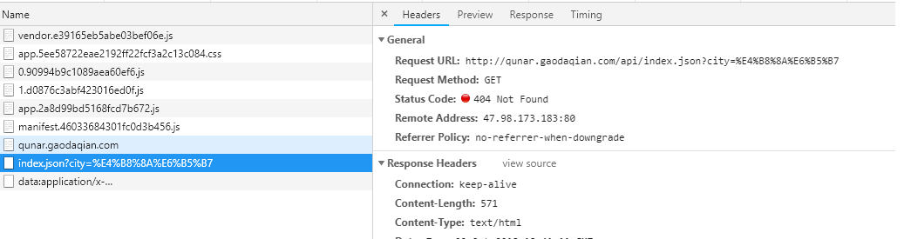
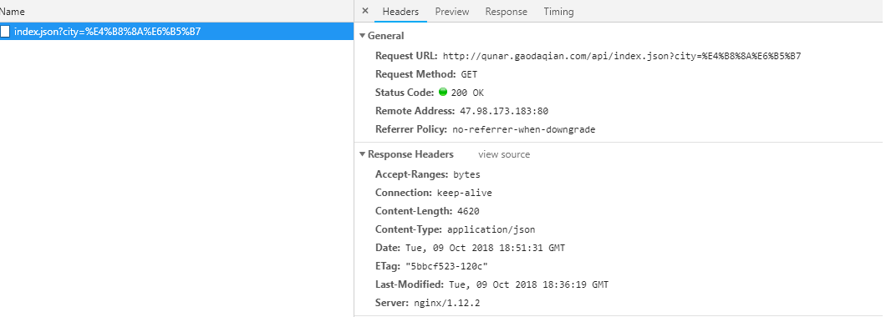

# 生产环境JSON404

### 开发环境请求本地 JSON

**static 目录如下**:

```bash
static
└── mock
   ├── city.json
   ├── detail.json
   └── index.json
```

**Vue 组件中请求接口代码如下**:

```js
getHomeInfo () {
  axios.get('/api/index.json?city=' + this.city).then(this.getHomeInfoSucc)
},
```

**config/index.js 文件设置的代理如下**:

```js
dev: {
    // Paths
    assetsSubDirectory: 'static',
    assetsPublicPath: '/',
    proxyTable: {
      '/api': {
        target: 'http://localhost:8080',
        pathRewrite: {
          '^/api': '/static/mock'
        }
      }
    },
    // ...省略其他
}
```

### 部署生产环境 404

`npm run build` 打包部署服务器后请求 `json` 的接口 `404`:



### Nginx 配置解决 404

从接口请求 `http://qunar.gaodaqian.com/api/index.json` 看到请求的资源目录是 `api` 目录下的 `index.json`, 而这个路径下的资源不是真实存在.

请求 http://qunar.gaodaqian.com/static/mock/index.json, 也就是在 `static` 目录下有 `index.json`

所以我们要做的是把 `/api/` 的请求转到 `/static/mock/` .

找到对应站点 `Nginx` 配置文件, 默认是 `nginx.conf`, 配置如下:

```bash
location /api/ {
    proxy_redirect off;
    proxy_set_header Host $host;
    proxy_set_header X-Real-IP $remote_addr;
    proxy_set_header X-Forwarded $proxy_add_x_forwarded_for;
    proxy_pass http://qunar.gaodaqian.com/static/mock/;
}
```


