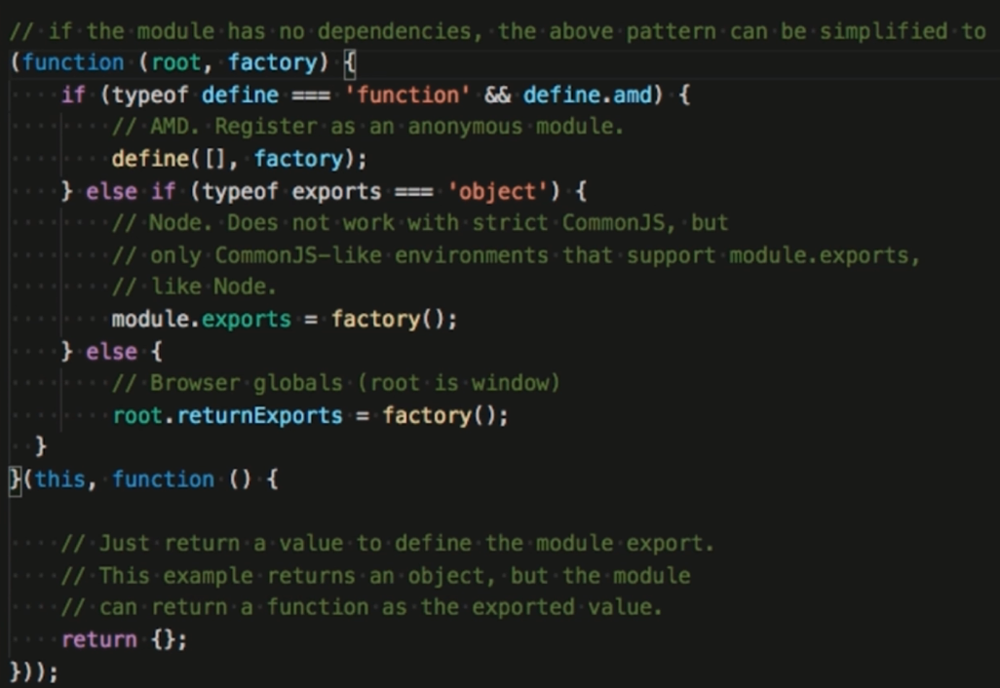

# JS 模块化

### 命名空间

库名.类别名.方法名

```JS
var NameSpace = {}

NameSpace.type = NameSpace.type || {}

NameSpace.type.method = function () {

}
```

YUI 沙箱机制:


### CommonJS

Modules/1.1.1

一个文件一个模块

通过 module.exports 暴露模块接口

通过 require 引入模块


同步执行

### AMD/CMD/UMD

- AMD:

Async Module Definition

使用 define 定义模块

使用 requrie 加载模块

著名的库 RequireJS

依赖前置, 提前执行


- CMD

Common Module Definition

一个文件为一个模块

使用 define 来定义一个模块

使用 requrie 来加载一个模块

SeaJS

尽可能懒执行


- UMD

Universal Module Definition

通用解决方案

三个步骤:

判断是否支持 AMD

判断是否支持 CommonJS

如果都没有 使用全局变量



### ES6 module(ESM)

EcmaScript Module

一个文件一个模块

export/import


### Webpacl 支持

AMD (RequireJS)

ES Modules(推荐的)

CommonJS