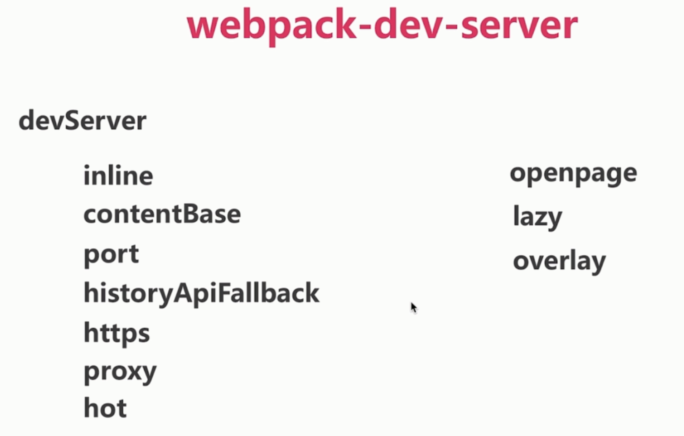

# 搭建开发环境 webpack-dev-server

方式一: webpack watch mode

方式二: webpack-dev-server

方式三: express + webpack-dev-middleware

### 打包删除旧代码

打包删除旧代码: `npm i clean-webpack-plugin -D`

```js
var CleanWebpackPlugin = require('clean-webpack-plugin')

...
plugins: [
  new CleanWebpackPlugin(['dist'])
]
```

### webpack watch mode

webpack -watch 或者 webpack -w

```bash
webpack -w --progress --display-reasons --color
```

### webpack-dev-server

官方提供的服务器.

live reloading

不是打包文件, 加载到内存, 用于开发

路径重定向

https

浏览器中显示编译错误

接口代理

模块热更新

配置 devSever:

inline、contentBase、port、historyApiFallback、https、proxy、hot、openpage、lazy、overlay



安装: `npm i webpack-dev-server -D`

配置 package.json:

```json
{
  "scripts": {
    "server": "webpack-dev-server --open"
  }
}
```

然后执行 npm run server 运行.

配置 webpack.config.js:

```js
// 不需要 require
devSever: {
  inline: true, // 为 true 是在浏览器看打包状态, false 是在页面顶部显示打包状态
  port: 9001,
  historyApiFallback: { // 重定向, /a 匹配到 /a.html
    rewrites: [
      {
        from: /^\/([a-zA-Z0-9]+\/?)([a-zA-Z0-9]+)/,
        to: function (context) {
          return '/' + context.match[1] + context.match[2] + '.html'
        }
      }
    ]
  }
}
```