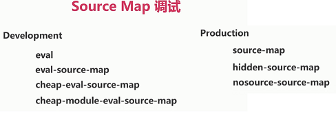
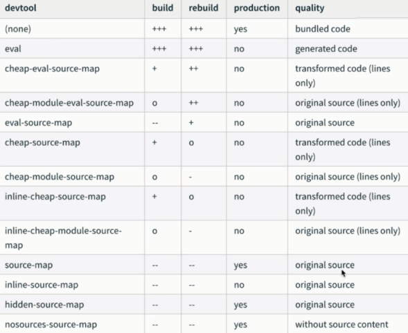

# Source Map 调试

JS Source Map、CSS Source Map

开启:

方式一: devtool

方式二:

webpack.SourceMapDevToolPlugin

webpack.EvalSourceMapDevToolPlugin

### devtool

配置项:



速度表:



配置 webpack.config.js:

```js
module.exports = {
  devtool: 'eval', // 值有很多, 一般用 eval
}
```

### CSS Source Map

css-loader.option.sourcemap

less-loader.option.sourcemap

sass-loader.option.sourcemap

配置 webpack.config.js:

给每一个样式的 loader 加 sourceMap: true.

```js
module: {
    rules: [
      {
        test: /\.less$/,
        use: ExtractTextWebpackPlugin.extract({
          fallback: {
            loader: 'style-loader',
            options: {
                // singleton: true, 这个要注释才可以
                sourceMap: true
            }
          },
          use: [
            {
              loader: 'css-loader',
              options: {
                minimize: true,
                sourceMap: true
              }
            },
            {
              loader: 'less-loader',
              options: {
                sourceMap: true
              }
            }
          ]
        })
      }
    ]
  },
```