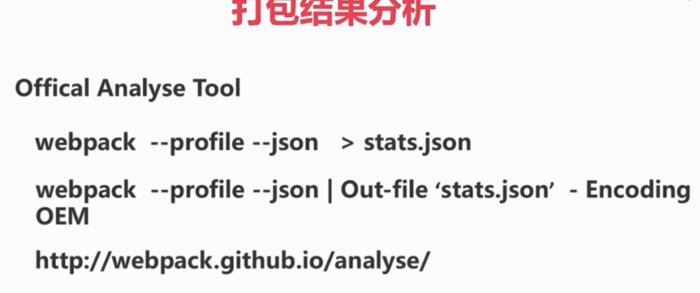
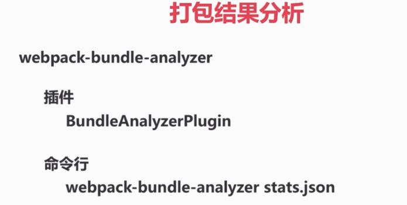
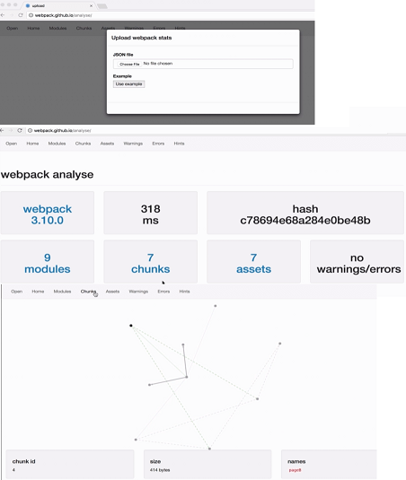
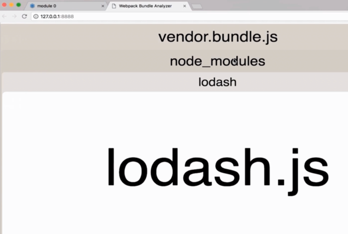

# 打包结果分析

官方的: Offical Analyse Tool

其他: webpack-bundle-analyzer

### Offical Analyse Tool

执行命令生成 json 文件, 上传到官网, 得到结果



### webpack-bundle-analyzer



### 实战 Offical Analyse Tool

生产 stats.json:

```bash
# mac 下
webpack --profile --json > stats.json
```



### 实战 webpack-bundle-analyzer

安装: `npm i webpack-bundle-analyzer -D`

配置 webpack.config.js:

```js
var BundleAnalyzerPlugin = require("webpack-bundle-analyzer").BundleAnalyzerPlugin;

...

plugins: [
    new BundleAnalyzerPlugin(),
  ]
```

