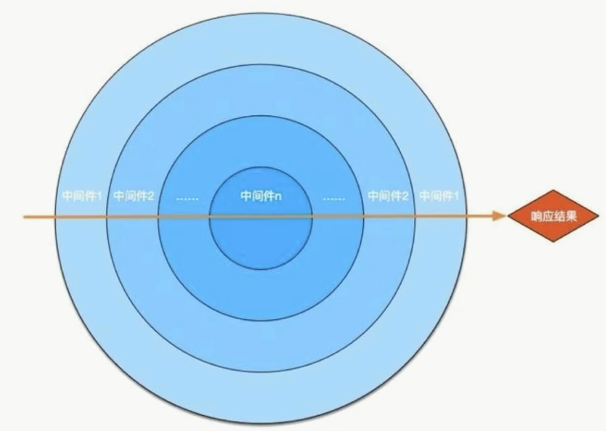

# koa2 入门

### koa 是什么

基于 `nodejs` 平台的下一代 `web` 开发框架.

`exporess` 原班人马打造, 更精简

`async` + `await` 处理异步

洋葱模型的中间件机制

```js
const Koa = require('koa2')
const app = new Koa()

app.use(async(ctx, next)=>{
  ctx.body = 'hello koa2'
})

app.listen(3000)
```

- 洋葱模型

