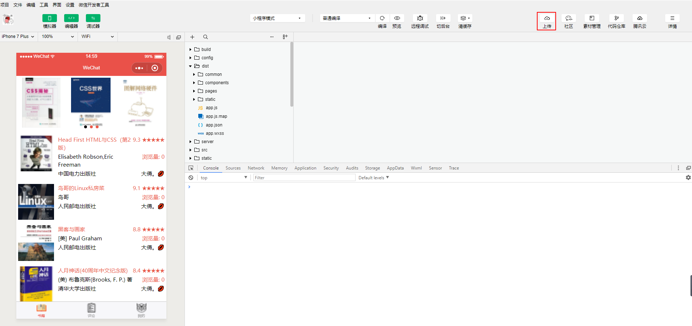
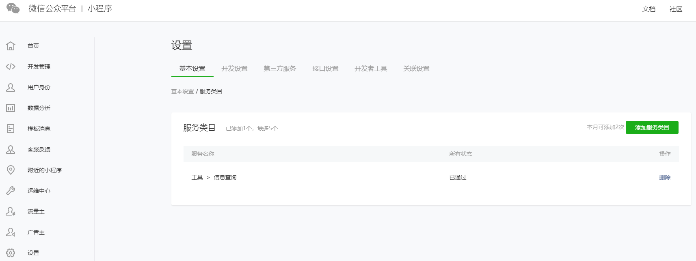
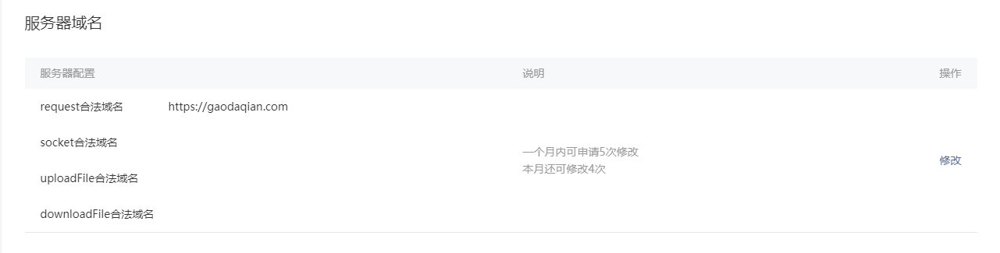
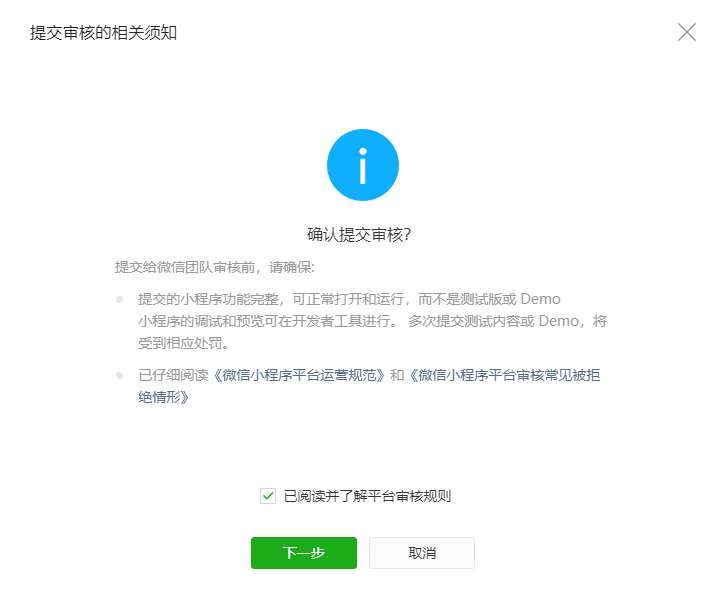
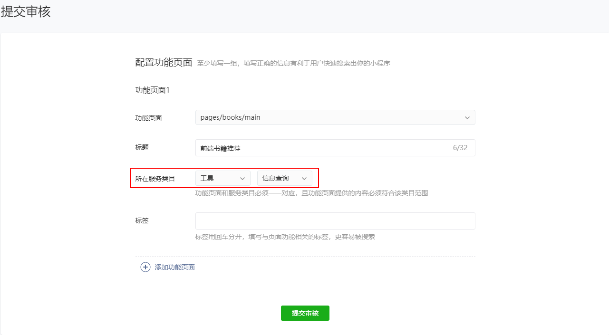
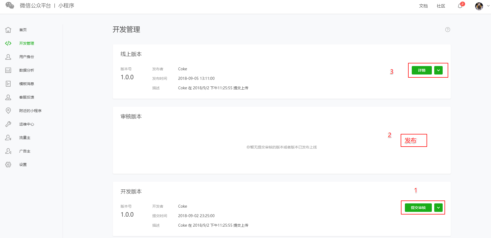

# 客户端上传代码及审核

### 上传代码

微信开发者工具 -> 上传.

### 设置小程序服务类目

[小程序官网管理后台](https://mp.weixin.qq.com/wxopen/wacodepage) `设置` -> `基本设置` -> `服务类目` -> `工具->信息查询`

### 服务器域名设置

[小程序官网管理后台](https://mp.weixin.qq.com/wxopen/wacodepage) `设置` -> `开发设置` -> `服务器域名` -> `request合法域名`

### 提交审核

- 配置功能页面

[小程序官网管理后台](https://mp.weixin.qq.com/wxopen/wacodepage) 我这里配置了一个功能页面, `选择功能页面`, 输入 `标题`和 `标签`

**所在服务类目**, 这里不能乱填, 因为我调接口查数据了, 第一次过审没通过, 让我改成 `工具->信息查询`.

### 发布线上版本

[小程序管理界面](https://mp.weixin.qq.com/wxopen/wacodepage)  -> 开发管理 -> 点击 **审核版本**的发布.

### 总结

`开发者工具上传客代码` -> `小程序管理界面提交审核` -> `配置功能页面` -> `审核通过(一天左右能通过)` -> `发布线上版本` -> `下载小程序二维码` -> `微信扫码`.

