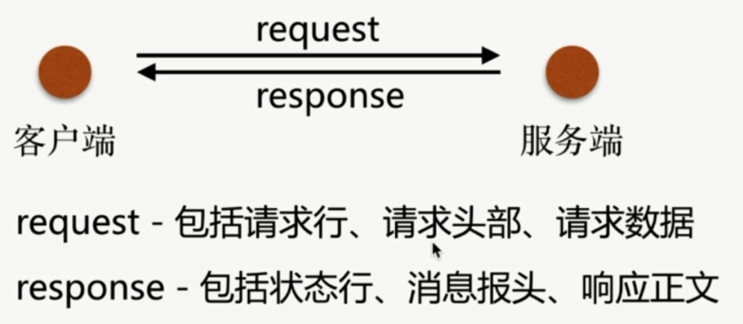

# HTTP



- curl

`curl http://www.baidu.com`

发起请求.

`curl -v http://www.baidu.com >/dev/null`:

查看请求响应到空设备.

```bash
[root ~]# curl -v http://www.baidu.com >/dev/null
  % Total    % Received % Xferd  Average Speed   Time    Time     Time  Current
                                 Dload  Upload   Total   Spent    Left  Speed
  0     0    0     0    0     0      0      0 --:--:-- --:--:-- --:--:--     0*
  About to connect() to www.baidu.com port 80 (#0)
*   Trying 115.239.210.27...
* Connected to www.baidu.com (115.239.210.27) port 80 (#0)
> GET / HTTP/1.1
> User-Agent: curl/7.29.0
> Host: www.baidu.com
> Accept: */*
>
< HTTP/1.1 200 OK
< Accept-Ranges: bytes
< Cache-Control: private, no-cache, no-store, proxy-revalidate, no-transform
< Connection: Keep-Alive
< Content-Length: 2381
< Content-Type: text/html
< Date: Tue, 28 Aug 2018 00:31:24 GMT
< Etag: "58860505-94d"
< Last-Modified: Mon, 23 Jan 2017 13:28:37 GMT
< Pragma: no-cache
< Server: bfe/1.0.8.18
< Set-Cookie: BDORZ=27315; max-age=86400; domain=.baidu.com; path=/
<
{ [data not shown]
100  2381  100  2381    0     0   198k      0 --:--:-- --:--:-- --:--:--  211k
* Connection #0 to host www.baidu.com left intact
```