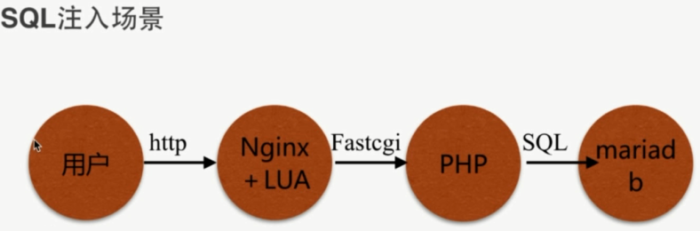

# SQL 注入

`SQL` 注入 - 利用未过滤/未审核用户输入的攻击方法, 让应用运行本不应该运行的 `SQL` 代码



- `phpserver.conf`

```bash
location ~ \.php$ {
  fastcgi_pass   127.0.0.1:9000;
  fastcgi_index  index.php;
  #fastcgi_param  SCRIPT_FILENAME  /scripts$fastcgi_script_name;
  fastcgi_param  SCRIPT_FILENAME   /opt/app/code/$fastcgi_script_name;
  include        fastcgi_params;
}
```