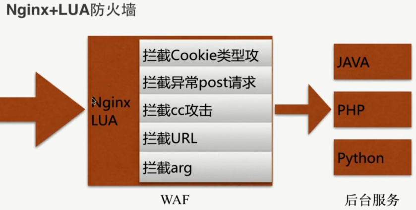
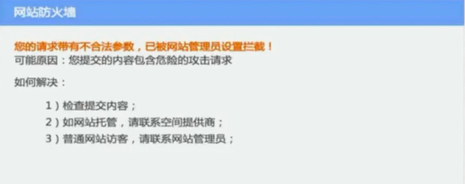

# `Nginx + LUA` 防火墙 WAF



### 下载 waf

[waf github](https://github.com/loveshell/ngx_lua_waf)

```bash
# git 克隆代码
[root download]# git clone https://github.com/loveshell/ngx_lua_waf.git
Cloning into 'ngx_lua_waf'...
remote: Counting objects: 538, done.
remote: Total 538 (delta 0), reused 0 (delta 0), pack-reused 538
Receiving objects: 100% (538/538), 82.47 KiB | 38.00 KiB/s, done.
Resolving deltas: 100% (298/298), done.
[root download]# cd /etc/nginx/
# 拷贝到 /etc/nginx/waf/ 目录
[root nginx]# mv /opt/download/ngx_lua_waf/ ./waf/
[root nginx]# cd waf
[root waf]# ls -al
total 52
drwxr-xr-x 4 root root 4096 Aug 29 18:05 .
drwxr-xr-x 7 root root 4096 Aug 29 18:08 ..
-rw-r--r-- 1 root root 2377 Aug 29 18:05 config.lua
drwxr-xr-x 8 root root 4096 Aug 29 18:05 .git
-rw-r--r-- 1 root root  483 Aug 29 18:05 .gitattributes
-rw-r--r-- 1 root root 1970 Aug 29 18:05 .gitignore
-rw-r--r-- 1 root root 6405 Aug 29 18:05 init.lua
-rw-r--r-- 1 root root 1587 Aug 29 18:05 install.sh
-rw-r--r-- 1 root root 4612 Aug 29 18:05 README.md
drwxr-xr-x 2 root root 4096 Aug 29 18:05 wafconf
-rw-r--r-- 1 root root 2295 Aug 29 18:05 waf.lua
# 编辑配置里面的文件路径
[root waf]# vim config.lua
```

把路径修改正确 `RulePath = "/etc/nginx/conf/waf/wafconf/"`

### 配置 nginx

`/etc/nginx/nginx.conf`

```bash
http {
    include       /etc/nginx/mime.types;
    default_type  application/octet-stream;

    lua_package_path "/etc/nginx/waf/?.lua";
    lua_shared_dict limit 10m;
    init_by_lua_file  /etc/nginx/waf/init.lua;
    access_by_lua_file /etc/nginx/waf/waf.lua;

    log_format  main  '$remote_addr - $remote_user [$time_local] "$request" '
                      '$status $body_bytes_sent "$http_referer" '
                      '"$http_user_agent" "$http_x_forwarded_for" "$request_uri" "$uri"';

    access_log  /var/log/nginx/access.log  main;

    sendfile        on;
    #tcp_nopush     on;

    keepalive_timeout  65;

    #gzip  on;

    include /etc/nginx/conf.d/*.conf;
}
```

规则都在 `/etc/nginx/waf/wafconf/post` 中

```bash
[root waf]# cd wafconf/
[root wafconf]# ls
args  cookie  post  url  user-agent  whiteurl
# waf 规则
[root wafconf]# cat post
...
```

`post` 文件新增规则

```bash
\sor\s+
select.+(from|limit)
(?:(union(.*?)select))
having|rongjitest
sleep\((\s*)(\d*)(\s*)\)
benchmark\((.*)\,(.*)\)
base64_decode\(
(?:from\W+information_schema\W)
(?:(?:current_)user|database|schema|connection_id)\s*\(
(?:etc\/\W*passwd)
into(\s+)+(?:dump|out)file\s*
group\s+by.+\(
xwork.MethodAccessor
(?:define|eval|file_get_contents|include|require|require_once|shell_exec|phpinfo|system|passthru|preg_\w+|execute|echo|print|print_r|var_dump|(fp)open|alert|showmodaldialog)\(
xwork\.MethodAccessor
(gopher|doc|php|glob|file|phar|zlib|ftp|ldap|dict|ogg|data)\:\/
java\.lang
\$_(GET|post|cookie|files|session|env|phplib|GLOBALS|SERVER)\[
\<(iframe|script|body|img|layer|div|meta|style|base|object|input)
(onmouseover|onerror|onload)\=
```

### 访问测试

