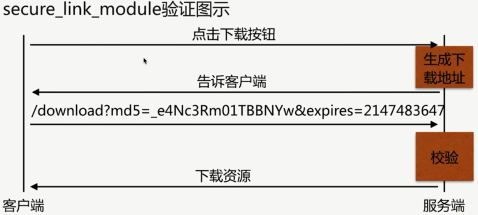
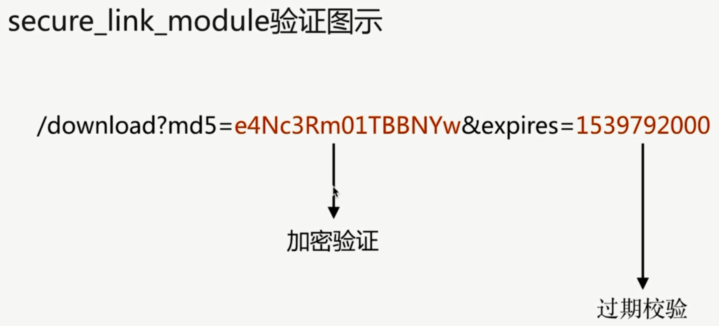

# `secure_link_module`

### 功能

- 制定并允许检查请求的链接的真实性以及保护资源免遭未经授权的访问

- 限制链接生效周期

### 配置语法

```bash
Syntax: secure_link expression;
Default: ---
Context: http, server, location
```

```bash
Syntax: secure_link_md5 expression;
Default: ---
Context: http, server, location
```





```bash
server {
    listen       80;
    server_name  localhost;

    root /opt/app/code;

    location / {
        secure_link $arg_md5,$arg_expires;
        # imooc 是自定义的加密串
        secure_link_md5 "$secure_link_expires$uri imooc";

        if ($secure_link = "") {
            return 403;
        }

        if ($secure_link = "0") {
            return 410;
        }
    }

    error_page   500 502 503 504 404  /50x.html;
    location = /50x.html {
        root   /usr/share/nginx/html;
    }
}
```

### md5url.sh

生成请求的串

```bash
#!/bin/sh
servername="jeson.t.imooc.io"
download_file="/download/file.img"
time_num=$(date -d "2018-10-18 00:00:00" +%s)
# 与上面的串一致 imoocc
secret_num="imoocc"
# openssl 要 yum 安装下
res=$(echo -n "${time_num}${download_file} ${secret_num}"|openssl md5 -binary | openssl base64 | tr +/ -_ | tr -d =)

echo "http://${servername}${download_file}?md5=${res}&expires=${time_num}"
```