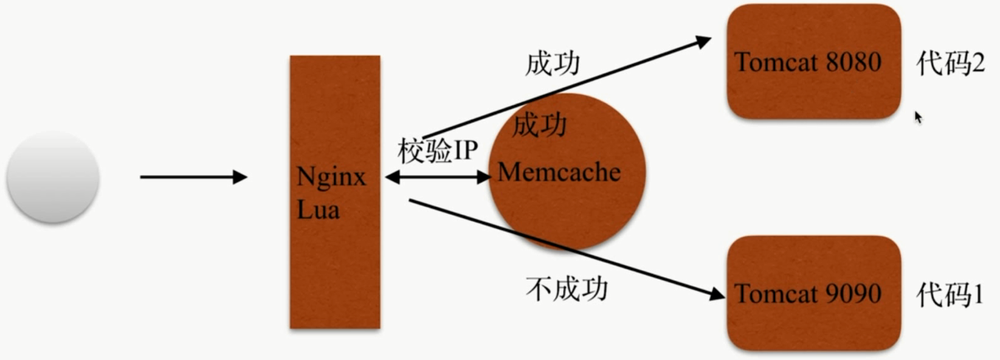

# 灰度发布

### 场景

- 用户的信息 `cookie` 等信息区别

- 根据用户的 `ip` 地址



```bash
server {
    listen       80;
    server_name  localhost;

    access_log  /var/log/nginx/log/host.access.log  main;

    location /hello {
        default_type 'text/plain';
        content_by_lua 'ngx.say("hello, lua")';
    }

    location /myip {
        default_type 'text/plain';
        content_by_lua '
            clientIP = ngx.req.get_headers()["x_forwarded_for"]
            ngx.say("IP:",clientIP)
            ';
    }

    location / {
        default_type "text/html"; 
        content_by_lua_file /opt/app/lua/dep.lua;
        #add_after_body "$http_x_forwarded_for";
    }

    location @server{
        proxy_pass http://127.0.0.1:9090;
    }

    location @server_test{
        proxy_pass http://127.0.0.1:8080;
    }

    error_page   500 502 503 504 404  /50x.html;
    location = /50x.html {
        root   /usr/share/nginx/html;
    }
}
```

- `dep.lua`

```bash
clientIP = ngx.req.get_headers()["X-Real-IP"]
if clientIP == nil then
    clientIP = ngx.req.get_headers()["x_forwarded_for"]
end
if clientIP == nil then
    clientIP = ngx.var.remote_addr
end
    local memcached = require "resty.memcached"
    local memc, err = memcached:new()
    if not memc then
        ngx.say("failed to instantiate memc: ", err)
        return
    end
    local ok, err = memc:connect("127.0.0.1", 11211)
    if not ok then
        ngx.say("failed to connect: ", err)
        return
    end
    local res, flags, err = memc:get(clientIP)
    ngx.say("value key: ",res,clientIP)
    if err then
        ngx.say("failed to get clientIP ", err)
        return
    end
    if  res == "1" then
        ngx.exec("@server_test")
        return
    end
    ngx.exec("@server")
```