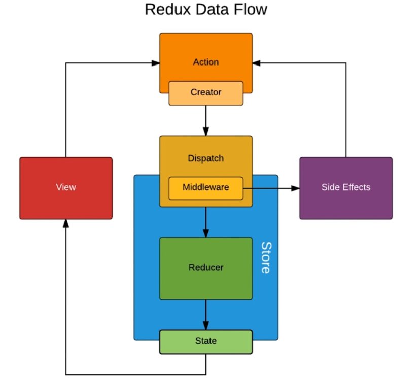

# redux 中间件介绍

中间件指的都是 `redux` 中间件.

`redux` 中间件的 **'中间'** 指的是 `action` 和 `store` 之间, 以前 `action` 只能是一个对象,  使用 `redux-thunk` 中间件之后可以是一个 **函数**.

`redux` 中间件很多, 比如还有 redux-logger、redux-saga.

实际上中间件就是对 `dispacth` 方法的一个封装和升级.

如果 `action` 传给 `store` 的是一个对象, 则直接传递.

如果 `action` 传给 `store` 的是一个函数, 则先执行函数.

