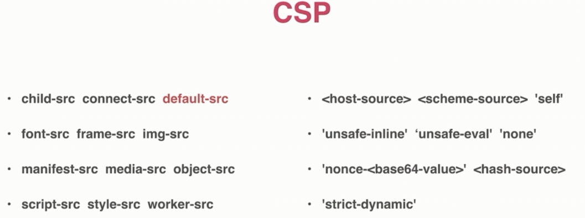

# CSP

Content Security Policy, 内容安全策略, 用于指定哪些内容可执行.



[Content-Security-Policy Headers](https://developer.mozilla.org/en-US/docs/Web/HTTP/Headers/Content-Security-Policy)

[script-src](https://developer.mozilla.org/en-US/docs/Web/HTTP/Headers/Content-Security-Policy/script-src)

语法: 设置响应头

```bash
Content-Security-Policy: default-src 'self' http://example.com;
                         connect-src 'none';
Content-Security-Policy: connect-src http://example.com/;
                         script-src http://example.com/
```