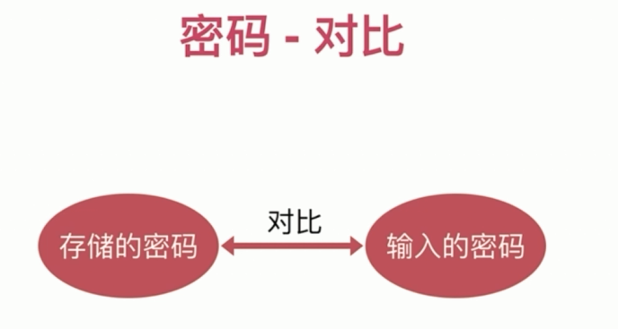
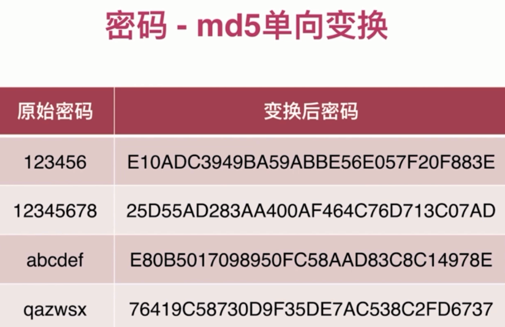
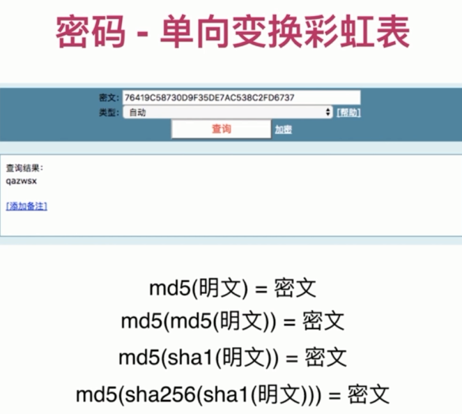
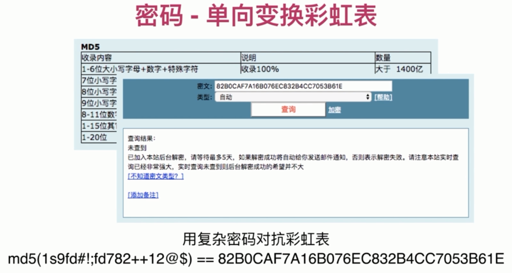
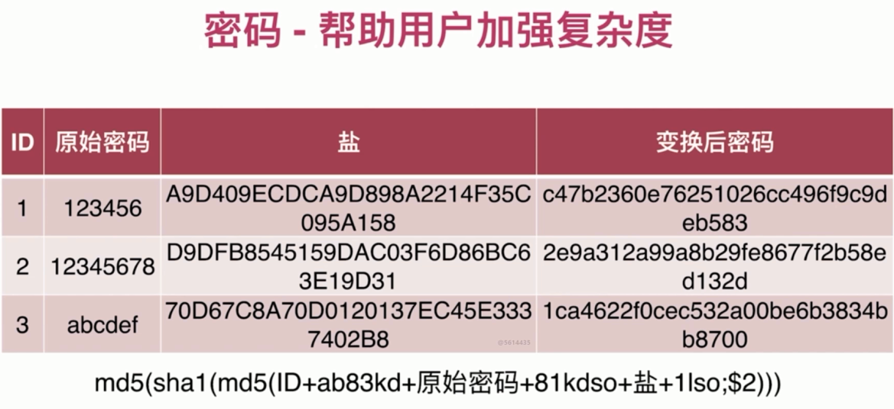

# 密码安全

- 密码的作用

"证明你是你"

- 密码的存储

- 密码的传输

- 密码的替代方案

- 生物特征密码的问题

### 密码 - 泄漏渠道

- 数据库被偷

- 服务器被入侵

- 通讯被窃听

- 内部人员泄漏数据

- 其他网站(撞库)

### 密码 - 存储

- 严禁明文存储(防泄漏)

- 单向变换(防泄漏)

- 变换复杂度要求(防猜解)

- 密码复杂度要求(防猜解)

- 加盐(防猜解)

### 密码 - 哈希算法

- 明文 - 密文一一对应

- 雪崩效应

- 密文 - 明文无法反推

- 密文固定长度

- 常见哈希算法: md5 sha1 sha256

### 密码 - md5 单向变换

### 密码 - 单向变换彩虹表

### 密码 - 帮助用户加强复杂度

### 密码 - 变换次数越多越安全

- 加密成本几乎不变(生成密码时速度慢一些)

- 彩虹表失效(数量太大, 无法建立通用性)

- 解密成本增大 N 倍

### 密码 - 密码传输的安全性

- https 传输

- 频率限制

- 前端加密意义有限

### 密码 - 生物特征密码

- 指纹(唇纹)

- 声纹

- 虹膜

- 人脸

- 私密性 - 容易泄露

- 安全性 - 碰撞

- 唯一性 - 终生唯一无法修改