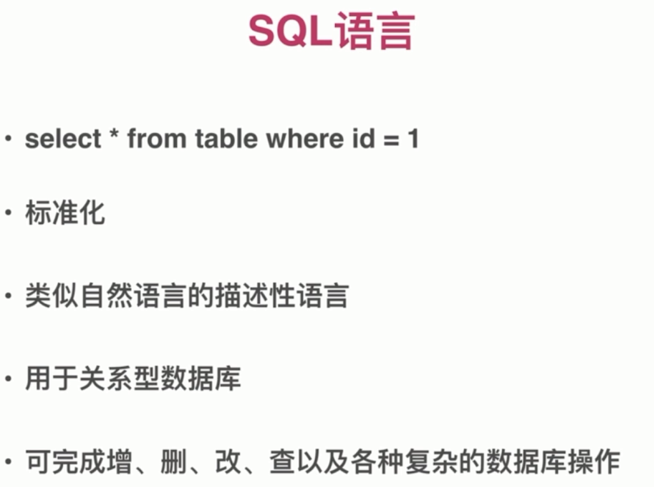
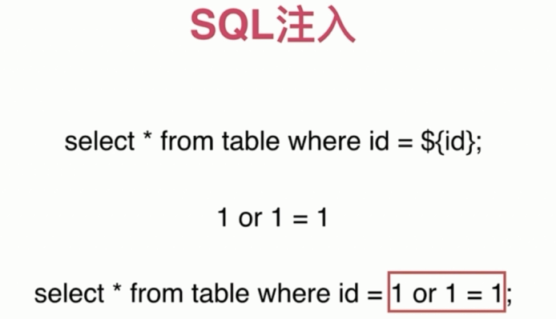
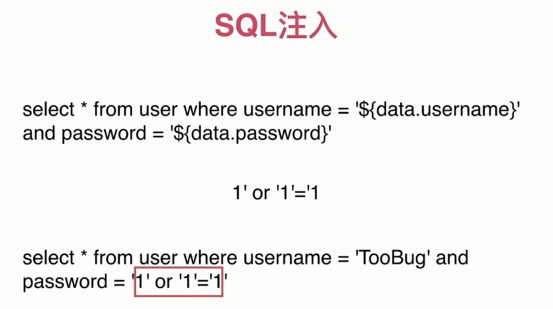
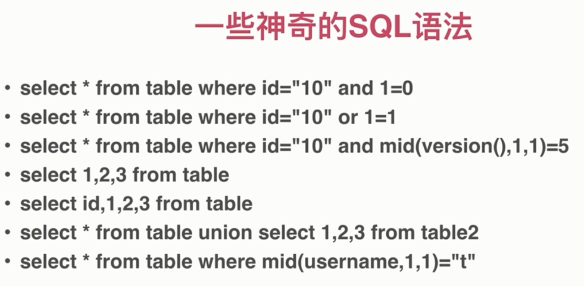

# SQL 注入

关系型数据库

- 存放结构化数据

- 可高效操作大量数据

- 方便处理数据之间的关联关系

- 常见: access/sqlite/mysql/mssql server

### SQL 注入

### SQL 注入危害

- 猜解密码

- 获取数据

- 删库删表

- 拖库

### SQL 注入防御

- 关闭错误输出

- 检查数据数据类型

- 对数据进行转义

- 使用参数化查询

- 使用 ORM (对象关系银蛇)

### NoSQL 注入和防御

- 检查数据类型

- 类型转换

- 写完整条件