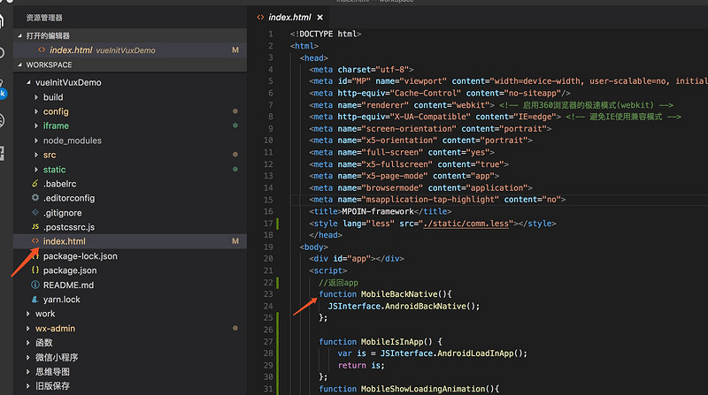
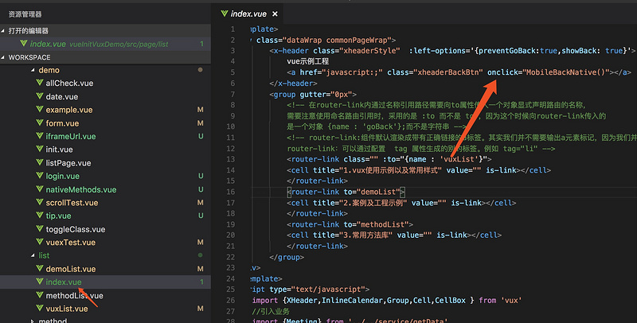
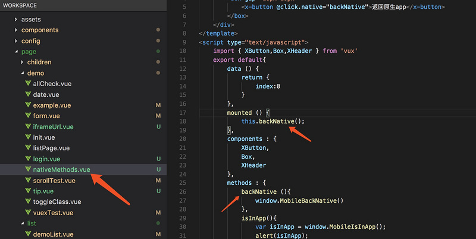
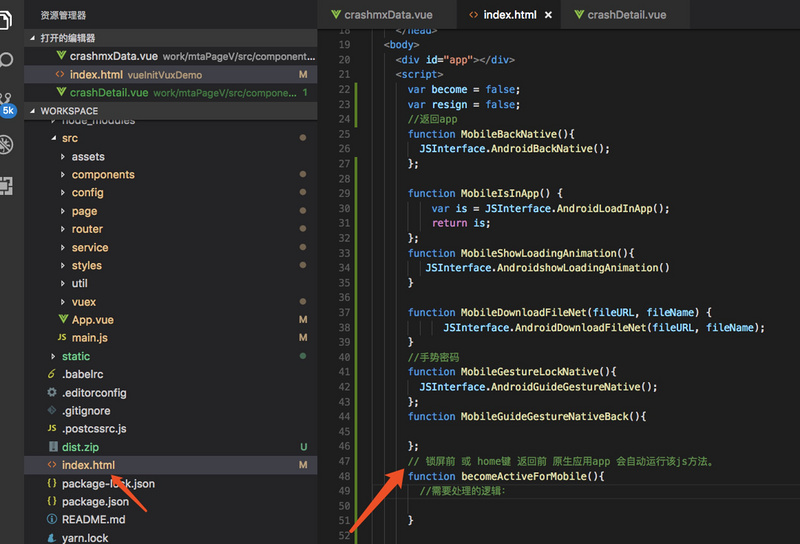

# 十三、混合开发：vue工程与app交互

:::danger 问题一：vue 如何调用 原生app 提供的方法
:::

在 vue-cli 中 调用 原生app 提供的方法：

>注意： 调用原生方法不需要自己区分android和ios。只需要按照以下步骤 声明 和 调用。

以调用`MobileBackNative 第三方应用返回原生app方法` 为例：

**第一步：** 在index.html里面声明 `mpoin提供的原生方法`



**第二步：** 在`.vue`组件中调用的几种方式  ：（ 调用时不需要自行区分ios和android，只需要选用以下某种方式调用即可兼容。 ）

 第一种：通过onclick方式调用：



 第二种：通过methods方式调用：


第三种：在 vue组件生命周期钩子中调用：



>[danger] 问题二：原生app 调用 vue 提供的方法，并将值传递到 .vue 组件中
>

只需要在`index.html`里面声明对应的方法，原生app即会自动调取：

例如锁屏前调用的js方法：



例如：`锁屏前`和`home键`返回前`原生应用`调用的`js方法`。

```js
function becomeActiveForMobile(){
    
}
```

可以将 index.html 里面的值 传递到 .vue 里面：

```js
function becomeActiveForMobile(value){
    //将vue传人vue组件中使用
    const event = new CustomEvent('some-event',{detail:{'string' : value}});
    document.body.dispatchEvent(event);
}
```

例在 index.vue 里面接收：

```html
<template>
	<div class="commonPageWrap">
		
	</div>
</template>
<script type="text/javascript">
	export default{
		data () {
			return {
				index:0
			}
		},
		mounted () {
				document.body.addEventListener('some-event', this.onSomeEvent.bind(this));
		},
		components : {
			
		},
		methods : {
			onSomeEvent(value){
				console.log(value);
			}
		}
	}
</script>
<style type="text/css" lang="less">
	
</style>
```