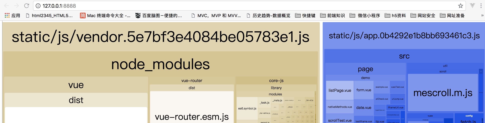

# 15.1 vue打包命令是什么？

:::danger 问题一：vue 打包命令是什么
:::

vue-cli 生成 生产环境部署资源 的 npm命令：

```bash
npm run build
```

用于查看 vue-cli 生产环境部署资源文件大小的 npm命令：

```bash
npm run build --report
```

**此命令必答，可以加深面试官好感！**

命令效果：



在浏览器上自动弹出一个 展示 vue-cli 工程打包后 app.js、manifest.js、vendor.js 文件里面所包含代码的页面。可以具此优化 vue-cli 生产环境部署的静态资源，提升 页面 的加载速度。