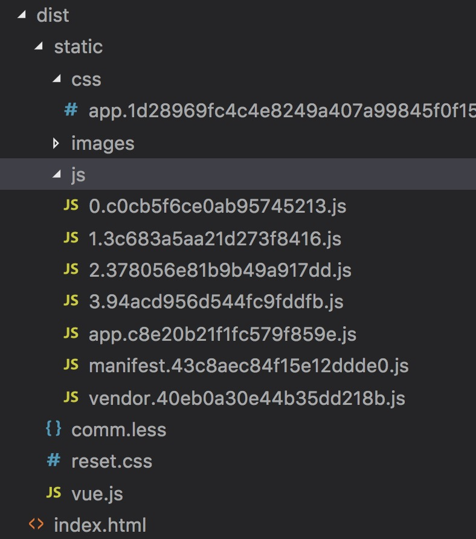

# 15.2 vue打包后会生成哪些文件？

:::danger 问题一：vue 打包后会生成哪些文件
:::

默认生产 dist 文件夹：

生产index.html单页面文件

将组件中的 css 编译合并成一个 app.[hash].css 的文件，

js 则在合并后又拆解成 了 3 个文件：

* app.[hash].js 包含了所有 components 中的 js 代码
* vendor.[hash].js 包含了生产环境所有引用的 node_modules 中的代码
* mainfest.[hash].js 则包含了 webpack 运行环境及模块 化所需的 js 代码
* 0.[hash].js 则是 vue-router 使用了按需加载生产的js文件

::: tip 这样拆分的好处是：
每块组件修改重新编译后不影响其他未修改的 js 文件 的 hash 值，这样能够最大限度地使用缓存，减少 HTTP 的请求数。
:::
