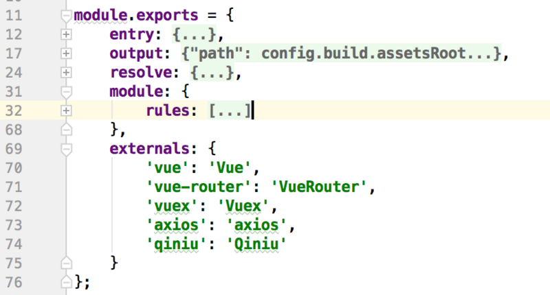
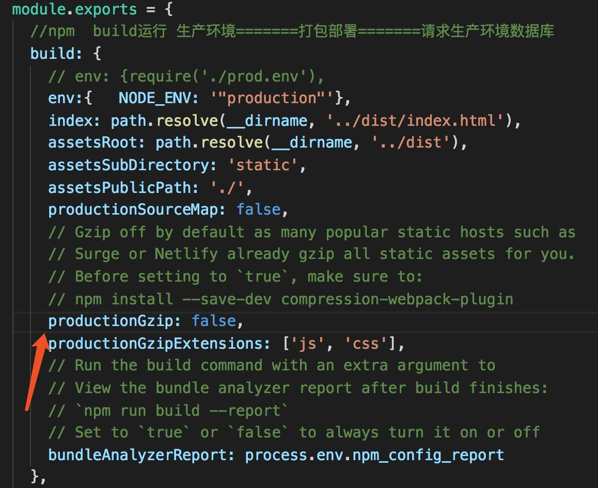

# 15.4  vue如何优化首屏加载速度？

:::danger 问题一：vue 如何优化首屏加载速度
:::

>问题描述：
>
>在Vue项目中，引入到工程中的所有js、css文件，编译时都会被打包进vendor.js，浏览器在加载该文件之后才能开始显示首屏。若是引入的库众多，那么vendor.js文件体积将会相当的大，影响首屏的体验。
>解决方法是：
>
>将引用的外部js、css文件剥离开来，不编译到vendor.js中，而是用资源的形式引用，这样浏览器可以使用多个线程异步将vendor.js、外部的js等加载下来，达到加速首开的目的。外部的库文件，可以使用CDN资源，或者别的服务器资源等。

几种常用的优化方法：

1. 使用`npm run build --report` 命令进行大文件定位
2. 路由的按需加载
3. 将打包生成后 index.html页面 里面的JS文件引入方式放在 body 的最后 
4. 用文档的cdn文件代替 npm 安装包
5. UI库的按需加载
6. 开启 Gzip 压缩

**详解**：

* * * * *

**1、大文件定位**：

我们可以使用 `webpack`可视化插件 `Webpack Bundle Analyzer` 查看工程js文件大小，然后有目的的解决过大的js文件。
使用命令：

```bash
npm run build --report
```

参考链接：[大文件定位](https://www.kancloud.cn/hanxuming/vue-iq/728306)

**2、路由的按需加载**：

参考链接：[路由的懒加载](https://www.kancloud.cn/hanxuming/vue-iq/733855)

**3、将JS文件引入方式放在 body 的最后**：

默认情况下，build 后的 index.html 中，js 的引入是在 head 中，使用`html-webpack-plugin`插件，将`inject`的值改为`body`。就可以将 js 引入放到 body 最后。

首先下载插件：（一般vue-cli项目里默认有，可以package.json里面检查是否含有）

```bash
npm install html-webpack-plugin@2 --save-dev
```

在 build文件夹下`webpack.base.conf.js`配置：

```js
var htmlWebpackPlugin = require('html-webpack-plugin')
module.exports = {
    entry: './src/script/main.js',
    output: {
        filename: 'js/bundle.js',
        path: path.resolve(__dirname, 'dist')
    },
    plugins: [
        new htmlWebpackPlugin({
            inject: 'body'
        })
    ]
}
```

即在 plugins 里面加上 `htmlWebpackPlugin` 插件。

**4、用文档的cdn文件代替 npm 安装包**：

用文档的cdn文件代替，而不用打包到vender里面去。具体的做法是：

1、在index.html里面引入依赖库js文件

```html
<!-- index.html -->
<script src="https://cdn.bootcss.com/vue/2.3.3/vue.min.js"></script>
<script src="https://cdn.bootcss.com/axios/0.16.2/axios.min.js"></script>
```

2、在mian.js里面去掉第三方js的import,因为在第一步已经通过script标签引用进来了。

3、把第三方库的js文件从打包文件里去掉

>即在 build/webpack.base.conf.js文件的module里面与rules同层加入externals：



**5、UI库的按需加载**：

一般 UI库 都提供按需加载的方法，按照文档即可配置。

**6.、开启 Gzip 压缩**:

>Gzip:

在 config/index.js 设置 productionGzip 为 `true`，开启 Gzip 压缩

