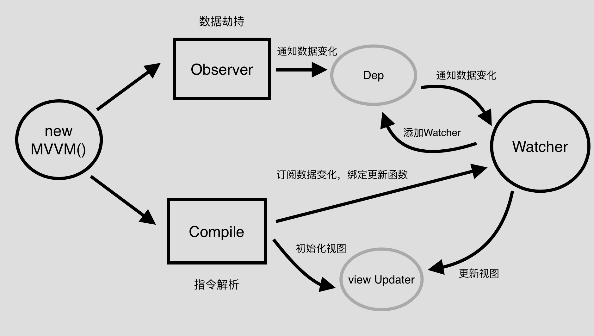

# 17.2 思路分析

:::danger 思路分析
:::

首先，我们根据流程图来理一下实现一个MVVM的思路，

如上图所示，我们可以看到，整体实现分为四步

- 1、实现一个Observer，对数据进行劫持，通知数据的变化
- 2、实现一个Compile，对指令进行解析，初始化视图，并且订阅数据的变更，绑定好更新函数
- 3、实现一个Watcher，将其作为以上两者的一个中介点，在接收数据变更的同时，让Dep添加当前Watcher，并及时通知视图进行update
- 4、实现MVVM，整合以上三者，作为一个入口函数