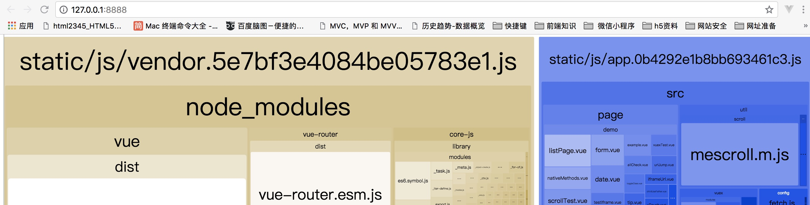
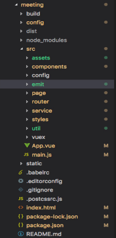
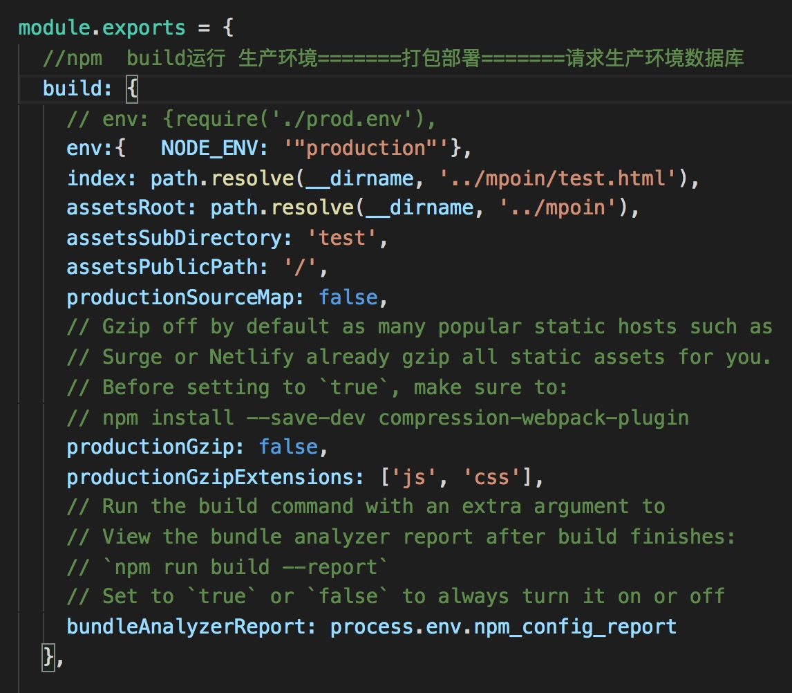
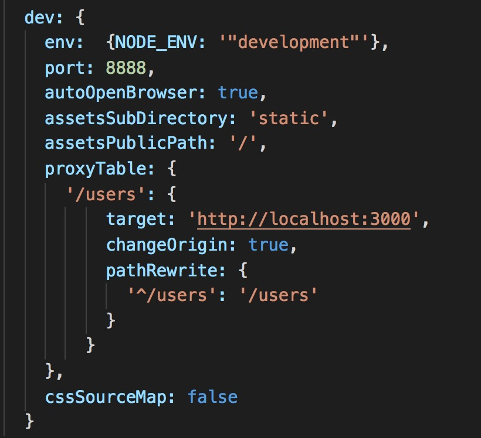

# 二、vue-cli 工程技术集合介绍

:::danger 问题一: 构建的 vue-cli 工程都到了哪些技术，它们的作用分别是什么？
:::

1. `vue.js`：vue-cli 工程的核心，主要特点是 **双向数据绑定** 和 **组件系统**。
2. `vue-router`：vue 官方推荐使用的路由框架。
3. `vuex`：专为 Vue.js 应用项目开发的状态管理器，主要用于维护 vue 组件间共用的一些 变量 和 方法。
4. `axios`（ 或者 fetch 、ajax ）：用于发起 GET 、或 POST 等 http 请求，基于 Promise 设计。
5. `vux` 等：一个专为 vue 设计的移动端UI组件库。
6. 创建一个 emit.js 文件，用于 vue 事件机制的管理。
7. `webpack`：模块加载和 vue-cli 工程打包器。

:::danger 问题二：vue-cli 工程常用的 npm 命令有哪些？
:::

**下载** node_modules 资源包的命令：

```bash
npm install
```

**启动** vue-cli 开发环境的 npm 命令：

```bash
npm run dev
```

vue-cli **生成** 生产环境部署资源 的 npm 命令：

```bash
npm run build
```

用于查看 vue-cli **生产环境部署资源文件大小** 的 npm 命令：

```bash
npm run build --report
```

命令效果：



在浏览器上自动弹出一个 展示 vue-cli 工程打包后 `app.js`、`manifest.js`、`vendor.js` 文件里面所包含代码的页面。

可以具此 **优化** vue-cli 生产环境部署的静态资源，提升页面的加载速度。

:::danger 问题三：请说出 vue-cli 工程中每个文件夹和文件的用处
:::

注意：此问题千万不要只解释一下 `src` 文件夹下每个文件夹的作用。



1. `build` 文件夹：用于存放 webpack 相关配置和脚本。开发中仅 偶尔使用 到此文件夹下 webpack.base.conf.js 用于配置 less、sass等css预编译库，或者配置一下 UI 库。
2. `config` 文件夹：主要存放配置文件，用于区分开发环境、线上环境的不同。 常用到此文件夹下 config.js 配置开发环境的 端口号、是否开启热加载 或者 设置生产环境的静态资源相对路径、是否开启gzip压缩、npm run build 命令打包生成静态资源的名称和路径等。
3. `dist` 文件夹：默认 npm run build 命令打包生成的静态资源文件，用于 **生产部署**。
4. `node_modules`：存放 npm 命令下载的开发环境和生产环境的 **依赖包**。
5. `src`: 存放项目源码及需要引用的资源文件。
6. src 下 `assets`：存放项目中需要用到的 **资源文件**，css、js、images 等。
7. src 下 `componets`：存放 vue 开发中一些 **公共组件**：header.vue、footer.vue 等。
8. src 下 `emit`：自己配置的 vue 集中式 **事件管理机制**。
9. src 下 `router`：vue-router vue **路由** 的配置文件。
10. src 下 `service`：自己配置的 vue **请求后台接口方法**。
11. src 下 `page`：存在 vue **页面组件**的文件夹。
12. src 下 `util`：存放 vue 开发过程中一些 **公共的 .js 方法**。
13. src 下 `vuex(或 store)`：存放 **vuex** 为 vue 专门开发的状态管理器。
14. src 下 `app.vue`：使用标签 `<route-view></router-view>` 渲染整个工程的 .vue 组件。
15. src 下 `main.js`：vue-cli 工程的入口文件。
16. `index.html`：设置项目的一些 **meta** 头信息和提供 `<div id="app"></div>` 用于挂载 vue 节点。
17. `package.json`：用于 node_modules 资源部 和 启动、打包项目的 npm 命令管理。

:::danger 问题四：config 文件夹 下 index.js 的对于工程 开发环境 和 生产环境 的配置
:::



`build` 对象下对于 **生产环境** 的配置：

* `index`：配置打包后入口 `.html` 文件的名称以及文件夹名称
* `assetsRoot`：配置打包后生成的文件名称和路径
* `assetsPublicPath`：配置 打包后 `.html` 引用静态资源的路径，一般要设置成 `./`
* `productionGzip`：是否开发 `gzip` 压缩，以提升加载速度



`dev` 对象下对于 **开发环境** 的配置：

* `port`：设置端口号
* `autoOpenBrowser`：启动工程时，自动打开浏览器
* `proxyTable`：`vue` 设置的代理，用以解决 跨域 问题

:::danger 问题五：请你详细介绍一些 package.json 里面的配置
:::

常用对象解析：

* `scripts`：`npm run xxx` 命令调用 node 执行的 `.js` 文件
* `dependencies`：**生产环境依赖包** 的名称和版本号，即这些依赖包都会打包进生产环境的 js 文件里面, 安装方式是 `npm i xxx -S`
* `devDependencies`：**开发环境依赖包** 的名称和版本号，即这些依赖包只用于代码开发 的时候，不会打包进生产环境 js 文件里面, 安装方式是 `npm i xxx -D`
