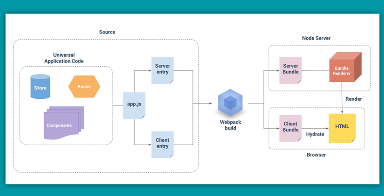

# 24.0 vue的服务器端渲染

### 构建流程

**app.js入口文件**:

app.js是我们的通用entry，它的作用就是构建一个Vue的实例以供服务端和客户端使用，注意一下，在纯客户端的程序中我们的app.js将会挂载实例到dom中，而在ssr中这一部分的功能放到了Client entry中去做了。

**两个entry**:

接下里我们来看Client entry和Server entry，这两者分别是客户端的入口和服务端的入口。`Client entry的功能很简单，就是挂载我们的Vue实例到指定的dom元素上`；`Server entry是一个使用export导出的函数。主要负责调用组件内定义的获取数据的方法，获取到SSR渲染所需数据`，并存储到上下文环境中。`这个函数会在每一次的渲染中重复的调用`。

**webpack打包构建**:

然后我们的服务端代码和客户端代码通过webpack分别打包，生成Server Bundle和Client Bundle，前者会运行在服务器上通过node生成预渲染的HTML字符串，发送到我们的客户端以便完成初始化渲染；而客户端bundle就自由了，初始化渲染完全不依赖它了。客户端拿到服务端返回的HTML字符串后，会去“激活”这些静态HTML，是其变成由Vue动态管理的DOM，以便响应后续数据的变化。

### 运行流程

到这里我们该谈谈ssr的程序是怎么跑起来的了。首先我们得去构建一个vue的实例，也就是我们前面构建流程中说到的app.js做的事情，但是这里不同于传统的客户端渲染的程序，我们需要用一个工厂函数去封装它，以便每一个用户的请求都能够返回一个新的实例，也就是官网说到的避免交叉污染了。

然后我们可以暂时移步到服务端的entry中了，这里要做的就是拿到当前路由匹配的组件，调用组件里定义的一个方法（官网取名叫asyncData）拿到初始化渲染的数据，而这个方法要做的也很简单，就是`去调用我们vuex store中的方法去异步获取数据`。

接下来node服务器如期启动了，跑的是我们刚写好的服务端entry里的函数。在这里还要做的就是将我们刚刚构建好的Vue实例渲染成HTML字符串，然后将拿到的数据混入我们的HTML字符串中，最后发送到我们客户端。

打开浏览器的network，我们看到了初始化渲染的HTML，并且是我们想要初始化的结构，且完全不依赖于客户端的js文件了。再仔细研究研究，里面有初始化的dom结构，有css，还有一个script标签。script标签里把我们在服务端entry拿到的数据挂载了window上。原来只是一个纯静态的HTML页面啊，没有任何的交互逻辑，所以啊，现在知道为啥子需要服务端跑一个vue客户端再跑一个vue了，服务端的vue只是混入了个数据渲染了个静态页面，客户端的vue才是去实现交互的！

### SSR 独特之处

在SSR中，创建Vue实例、创建store和创建router都是套了一层工厂函数的，目的就是避免数据的交叉污染。

在服务端只能执行生命周期中的created和beforeCreate，原因是在服务端是无法操纵dom的，所以可想而知其他的周期也就是不能执行的了。

服务端渲染和客户端渲染不同，需要创建两个entry分别跑在服务端和客户端，并且需要webpack对其分别打包；

SSR服务端请求不带cookie，需要手动拿到浏览器的cookie传给服务端的请求。实现方式戳这里。

SSR要求dom结构规范，因为浏览器会自动给HTML添加一些结构比如tbody，但是客户端进行混淆服务端放回的HTML时，不会添加这些标签，导致混淆后的HTML和浏览器渲染的HTML不匹配。

性能问题需要多加关注。

- vue.mixin、axios拦截请求使用不当，会内存泄漏。原因戳这里
- lru-cache向内存中缓存数据，需要合理缓存改动不频繁的资源。

:::danger 问题而：vue 的服务器端渲染
:::

:::tip 服务器端渲染(SSR)：
Vue.js 是构建客户端应用程序的框架。默认情况下，可以在浏览器中输出 Vue 组件，进行生成 DOM 和操作 DOM。然而，也可以将同一个组件渲染为服务器端的 HTML 字符串，将它们直接发送到浏览器，最后将这些静态标记"激活"为客户端上完全可交互的应用程序。

服务器渲染的 Vue.js 应用程序也可以被认为是"同构"或"通用"，因为应用程序的大部分代码都可以在服务器和客户端上运行。
:::

:::tip 为什么使用服务器端渲染(SSR)
与传统 SPA（Single-Page Application - 单页应用程序）相比，服务器端渲染(SSR)的优势主要在于：
:::

* 更好的 SEO，由于搜索引擎爬虫抓取工具可以直接查看完全渲染的页面。

请注意，截至目前，Google 和 Bing 可以很好对同步 JavaScript 应用程序进行索引。在这里，同步是关键。如果你的应用程序初始展示 loading 菊花图，然后通过 Ajax 获取内容，抓取工具并不会等待异步完成后再行抓取页面内容。也就是说，如果 SEO 对你的站点至关重要，而你的页面又是异步获取内容，则你可能需要服务器端渲染(SSR)解决此问题。
  
* * * * *

* 更快的内容到达时间(time-to-content)，特别是对于缓慢的网络情况或运行缓慢的设备。无需等待所有的 JavaScript 都完成下载并执行，才显示服务器渲染的标记，所以你的用户将会更快速地看到完整渲染的页面。通常可以产生更好的用户体验，并且对于那些「内容到达时间(time-to-content)与转化率直接相关」的应用程序而言，服务器端渲染(SSR)至关重要。

* * * * *

使用服务器端渲染(SSR)时还需要有一些权衡之处：

* * * * *

* 开发条件所限。浏览器特定的代码，只能在某些生命周期钩子函数(lifecycle hook)中使用；一些外部扩展库(external library)可能需要特殊处理，才能在服务器渲染应用程序中运行。

* 涉及构建设置和部署的更多要求。与可以部署在任何静态文件服务器上的完全静态单页面应用程序(SPA)不同，服务器渲染应用程序，需要处于 Node.js server 运行环境。

* 更多的服务器端负载。在 Node.js 中渲染完整的应用程序，显然会比仅仅提供静态文件的 server 更加大量占用 CPU 资源(CPU-intensive - CPU 密集)，因此如果你预料在高流量环境(high traffic)下使用，请准备相应的服务器负载，并明智地采用缓存策略。

参考链接：[nuxt.js](https://cn.vuejs.org/v2/guide/ssr.html)、[vue srr 指南](https://ssr.vuejs.org/zh/)

[解密Vue SSR](https://zhuanlan.zhihu.com/p/35871344)