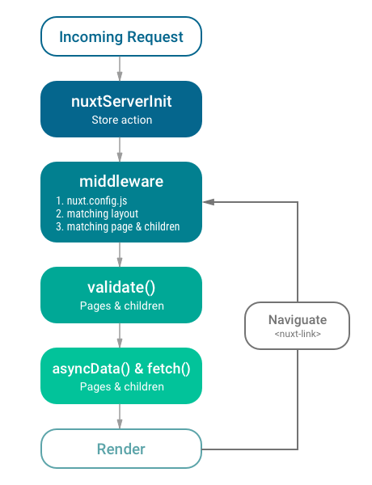
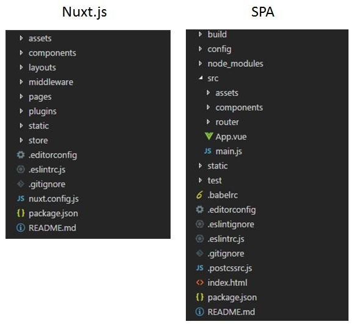
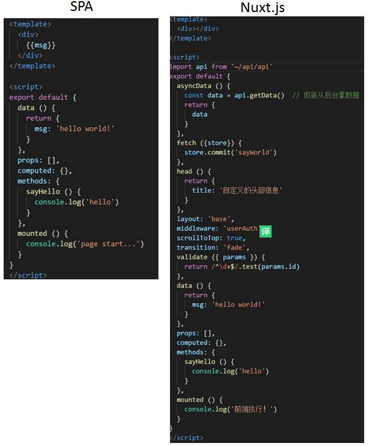
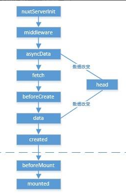
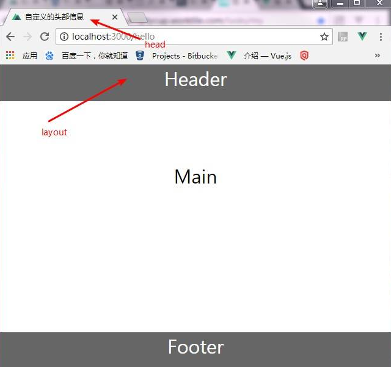
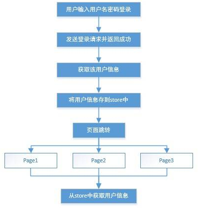
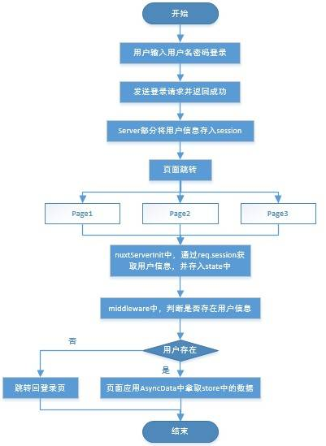

# 24.1 服务器端渲染与Nuxt.js

:::danger 问题一：为什么要用服务器端渲染
:::

以下总的列举服务器渲染的一些优缺点：

**优点**:

- `有利于 SEO`。
- `首屏加载速度快`。因为 SPA 引用需要在首屏获取所有资源，而服务器端渲染直接拿了成品展示出来就行了。
- `无需占用客户端资源`。解析模板工作交给服务器完成，对于客户端资源占用更少，尤其是移动端，也可以更省电。

**缺点**:

- `占用服务器资源`。服务器端完成html模板解析，如果请求较多，会对服务器造成一定的访问压力。而如果是前端渲染，就是把这些压力分摊给了前端。
- `不利于前后端分离`。

:::tip VUE SSR
:::


官网给出的这张构建步骤图也可以看出，对于客户端应用程序和服务器应用程序，我们都要使用 webpack 打包 - 服务器需要「服务器 bundle」然后用于服务器端渲染(SSR)，而「客户端 bundle」会发送给浏览器，用于混合静态标记。

:::tip Nuxt.js
:::

### Nuxt.js 是什么？

构建服务端渲染的 JavaScript 程序多少有些无趣，在开始编码之前，需要大量的基础配置。因此，解决 vue.js 服务端渲染问题的 Nuxt.js 产生了。

Nuxt.js 是一个基于 Vue.js 的通用应用框架。预设了服务器端渲染所需的各种配置，如异步数据，中间件，路由，只要遵循其中的规则就能轻松实现SSR。。它好比是 Angular Universal 之于 Angular， Next.js 之于 React。

通过对客户端/服务端基础架构的抽象组织，Nuxt.js 主要关注的是应用的 UI渲染。

除了 Vue.js 2.0 之外，Nuxt.js 集成了如下模块: Vue-Router, Vue-Meta 和 Vuex (仅在使用 Vuex 状态树配置项 时引入)。 这样的好处在于，不需要手工配置依赖，不需要同时在客户端和服务端配置相同的库。 Nuxt.js在包含如上依赖的情况下，总大小仍然保持在 `28kb min+gzip` (如果使用了 `Vuex` 特性的话为 `31kb`)。

另外，Nuxt.js 使用 Webpack 和 vue-loader 、 babel-loader 来处理代码的自动化构建工作（如打包、代码分层、压缩等等）。

### Nuxt.js 能做什么

- 无需再为了路由划分而烦恼，只需要按照对应的文件夹层级创建 .vue 文件就行
- 无需考虑数据传输问题，nuxt 会在模板输出之前异步请求数据（需要引入 axios 库），而且对 vuex 有进一步的封装
- 内置了 webpack，省去了配置 webpack 的步骤，nuxt 会根据配置打包对应的文件

### 工作原理

1. 当你访问一个基于 Nuxt.js 构建的页面时，发生了的事情如下：

2. 当用户访问应用程序, 如果 store 中定义了 `nuxtServerInit` action，Nuxt.js将调用它更新 store。

3. 接下来，将加载即将访问页面所依赖的任何中间件。Nuxt 首先从 `nuxt.config.js` 这个文件中，加载全局依赖的中间件，之后检测每个相应页面对应的布局文件 ，最后，检测布局文件下子组件依赖的中间件。以上是中间件的加载顺序。

4. 如果要访问的路由是一个动态路由, 且有一个相应的 `validate()` 方法路由的validate 方法，讲进行路由校验。

5. 之后, Nuxt.js 调用 `asyncData()` 和 `fetch()` 方法，在渲染页面之前加载异步数据。asyncData() 方法用于异步获取数据，并将fetch回来的数据，在服务端渲染到页面。 用 fetch() 方法取回的将数据在渲染页面之前填入store。

6. 最后一步, 将所有数据渲染到页面。

下图阐述了 Nuxt.js 应用一个完整的服务器请求到渲染的流程，摘自官网：



### Nuxt.js 的安装与运行

在安装vue-cli的情况下，快速生成一个nuxt项目的命令如下：

```bash
vue init nuxt-community/starter-template <project-name>
```

进入项目目录后

```bash
npm install
```

然后启动项目

```bash
npm run dev
```

这样项目就能正常运行在 http://localhost:3000 了

### Nuxt.js的目录结构



从上图可以看出，nuxt 似乎把 src 文件夹中的很多内容给放到了外边，少了一些文件，多了几个没见过的文件夹。这些文件夹各有各的用处。

- `layouts` 用于放置页面布局。
- `middleware` 用于放置一些中间件，我们在页面组件中可以引用这些中间件，在执行页面逻辑的时候会先执行其中的逻辑。
- `pages` 就是放置我们的所有页面组件啦，但是，与 spa 应用不同的是，nuxt 里的 page 会根据文件和文件夹结构生成对应的路由，打个比方，我 page 文件夹下的目录结构如下

```md
pages/
--| _slug/
-----| comments.vue
-----| index.vue
--| users/
-----| _id.vue
--| index.vue
```

Nuxt.js 生成对应的路由配置表为：

```js
router: {
  routes: [
    {
      name: 'index',
      path: '/',
      component: 'pages/index.vue'
    },
    {
      name: 'users-id',
      path: '/users/:id?',
      component: 'pages/users/_id.vue'
    },
    {
      name: 'slug',
      path: '/:slug',
      component: 'pages/_slug/index.vue'
    },
    {
      name: 'slug-comments',
      path: '/:slug/comments',
      component: 'pages/_slug/comments.vue'
    }
  ]
}
```

- `plugins` 集中放置一些插件，比如 axios 等。
- `store` 是集中定义状态树。nuxt.js已经集成了 vuex，这里只需要定义一个 index.js，然后对外暴露一个Vuex.Store 实例即可。但是，经过踩坑，这里的 `状态树` 和 SPA 里有些不一样，这个等会说。

### Nuxt.js的页面组件



从上图的 Nuxt.js 和 SPA 的 `.vue` 单页文件对比，，除了一般的 `.vue` 单页文件中的常规实例属性外（比如data, methods，props等），Nuxt.js还提供了很多方便又有意思的属性，这也是Nuxt.js最大的特点之一。



- 在 nuxt 内部的整个执行流程中，最先经过的是状态管理中 actions 中的 `nuxtServerInit` 函数，这个我们等会再说。
- 然后会经过 `middleware` 里的中间件函数，此时，还没有进行数据获取和页面渲染，所以我们可以在中间件函数中执行一些进入路由前的逻辑，比如用户权限判断。
- 之后开始获取页面数据，`asyncData` 和 `data` 的结果基本相同，我们可以直接调用 server 的接口，比如理由 axios 发送 http 请求获取页面所需的原始数据，然后以对象的形式 `return` 出去，此时，Vue 对象还没有实例化，所以 asyncData 里无法调用到 `this`。
- `fetch` 里主要用作填充状态树（store）数据。
- 这些全部做完以后，开始实例化 Vue 对象，这里的逻辑和单页应用是一样的，在组装好整个页面应用之后，nuxt.js 会将这个应用返回至前端。注意，这里返回的不是单纯的页面，而是应用。此时的页面局部 spa 应用的一些性质，比如数据监听双向绑定。
- 页面来到前端后，开始执行mount的相关逻辑。

除了应用的执行流程外，再看看页面渲染的模块。



- `head` 部分可以自定义当前页面的头部信息，比如 `title`, `meta` 之类的。当然，如果需要定义全局 `head` 可以在 `nuxt.config.js` 中配置。
- `layout` 部分可以自定义页面布局，很多页面公用的静态头、尾部分可以统一定义按需引用。
- `scrollToTop` 用于页面跳转时将页面滚动置顶。
- `transition` 用于页面间跳转的过渡动画。

### Vuex状态树

整个 demo 做下来，目前让我印象最深的就是状态树，它和 SPA 应用还是有一定区别的。
当时我需要完成的需求是，保存用户信息，并在任何页面可以使用它，如果非登录页没有获取到用户信息，跳转回登录页。
起初，我的设计思路是，在用户登录成功后，调用后台接口获取该用户所有信息，并且存在store中。流程图如下：



按照SPA应用的情况，store 里的数据应该在页面组件中都是共享的。但是，发现 Nuxt 中一旦页面跳转，整个Vuex 状态树会重置，原来存下的用户信息也没有了。由此可以推测，不同路由下的页面是一个独立的应用，它们并不会共享state中的数据。

这时我想到了本地会话存储 localStorage，只要把原流程中从 store 存取的逻辑改为从 localStorage 的逻辑即可。这种方式是可行的，但是这样一来，Vuex感觉存在感就不强了（此事必有蹊跷），并且就没法用 server 层来控制会话的过期等逻辑。

后来发现，服务器端渲染的 vuex 中的 action 中提供了一个方法：`nuxtServerInit`。Nuxt.js 调用它的时候会将页面的上下文对象作为第2个参数传给它，上下文对象可以拿到req请求对象，那么就存在这么一种逻辑。我可以将用户信息存储在服务器 session 中，然后通过 req.session.user 来访问当前登录的用户。将用户登录信息传给客户端的状态树，代码如下：

```js
actions: {
  nuxtServerInit ({ commit }, { req }) {
    if (req.session.user) {
      commit('user', req.session.user)
    }
  }
}
```

这样在配合 `middleware` 中间件，就可以完成用户信息获取和会话控制，流程如下：



原文链接：[带你走近Vue服务器端渲染](https://juejin.im/post/5b72d3d7518825613c02abd6), by 小牧_QAQ.